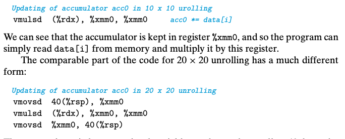

## 5.11 Some Limiting Factors

critical path 和 处理有多少个计算单元是性能的lower bound。

### 5.11.1 Register Splilling

单纯的拆分成更多的register在超过处理去本身的寄存器数量后反而会带来性能的下降，因为最终是通过memory来存储的，而非register，因为不够用了。

### 5.11.2 Branch Prediction and Misprediction Penalties

现代处理在执行当前的指令前，会把新的指令读取并解码，instruction pipeline将会很好地工作只要指令是顺序的，但如果有branch的话，处理去必须猜测哪个branch，否则就等待。

如果处理器实现了分支预测的话，那么处理器就会按照既定的指令执行，但并不修改任何实际的register或者memory。如果最终这个猜测正确，那么就可以commit这个修改，否则必须丢弃所有的结果，并重新获取指令。    

