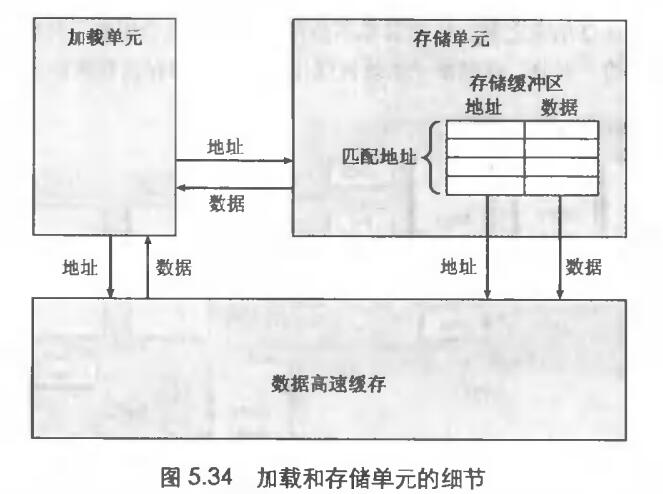
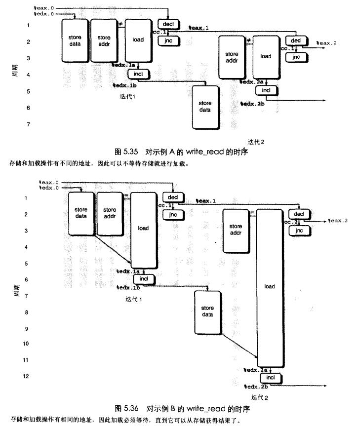
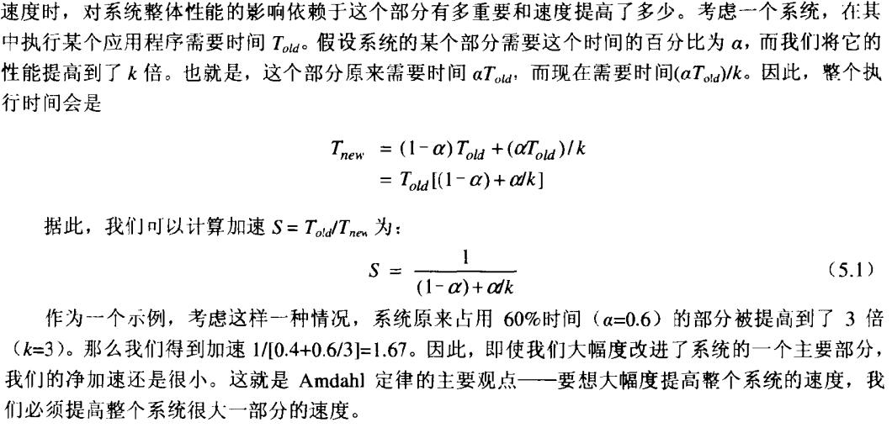

# Chapter.5 优化程序性能

--------------
## 存储缓冲区

上一个笔记中记录了`访问相同地址的比访问不同地址的性能还要差`这一问题 

存储单元中包含一个`存储缓冲区`  
存储缓冲区: 包含已经发射到存储单元而还没有完成存储操作的地址和数据,`完成包括更新高速缓存`  

当加载操作发生时，它必须检查`存储缓冲区`的条目，看有没有地址相匹配。如果有，就取出相应的条目作为加载的结果

> 加载单元和存储单元的数据流示意图



```
//翻译成单元操作,右侧是单元操作

.L32:
    movl %edx,(%ecx)         storeaddr (%ecx)
                             storedata %edx.0   
    movl (%ebx),%edx         load (%ebx)        -> %edx.1a
    incl %edx                incl %edx.1a       -> %edx.1b
    decl %eax                decl $eax.0        -> %eax.1
    jnc .L32                 jnc-taken cc.1
```

第一个movl被拆分为两个操作.先计算存储操作的地址,创建一个缓冲区条目,并且设置该条目的地址字段.然后调用`storedata`来设置该条目的数据字段




对于前一个笔记最后的那个程序而言,A和B分别对应上图中的图5.35和图5.36  
大体意思是:  
`load`指令前会先检查`storaddr`和目标地址是否一致,不一致的话就可以直接从高速缓存中读取数据  
否则,如果一致的话,就必须等待数据写入完成才能继续load

这就是为什么对于相同地址重复读写反而比不同地址要慢的原因

--------------
## 性能提高技术

- 高级设计: 设计编码时应该避免会频繁产生糟糕性能的算法或者编码技术
- 基本编码原则: 避免限制化的因素
    - 消除连续的函数调用
    - 消除不必要的存储引用
- 低级优化
    - 尝试各种与数组代码相对的指针形式
    - 通过展开循环降低循环开销
    - 通过诸如迭代分割之类的技术

--------------
## 确认和消除性能瓶颈

有点屠龙术的感觉

## Amdahl定律

主要思想是:  
当我们加快系统一个部分的速度时,对系统整体性能的影响依赖于这个部分有多重要和速度提升了多少.  
公式如下:  




--------------


> Latex转Svg

https://www.latexlive.com/