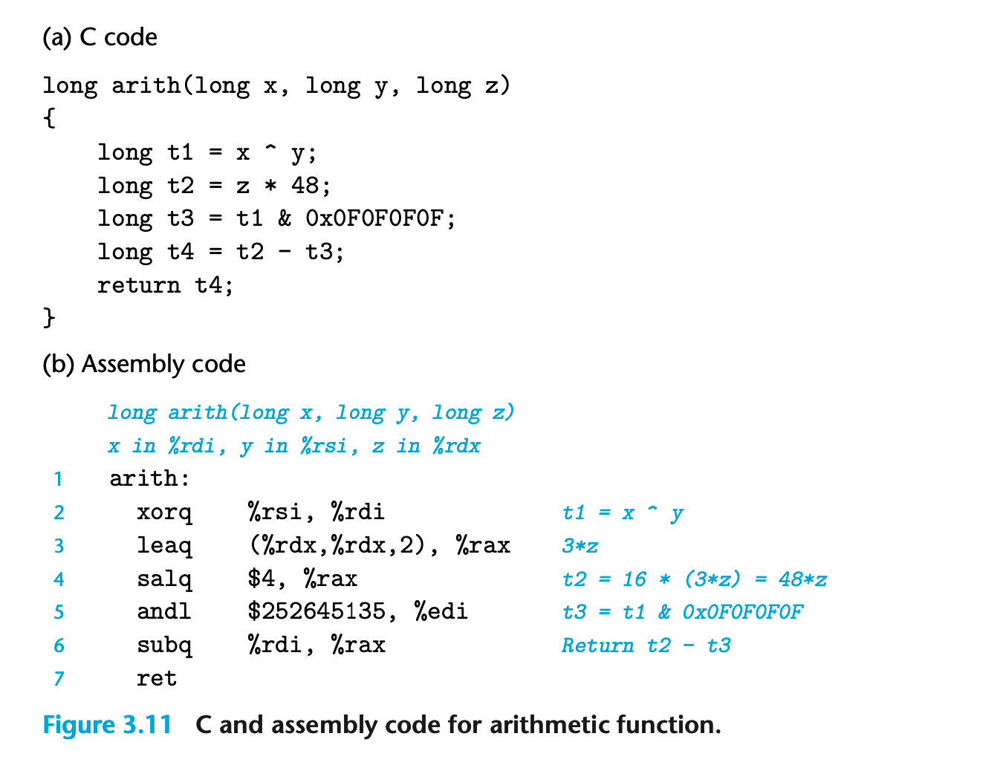
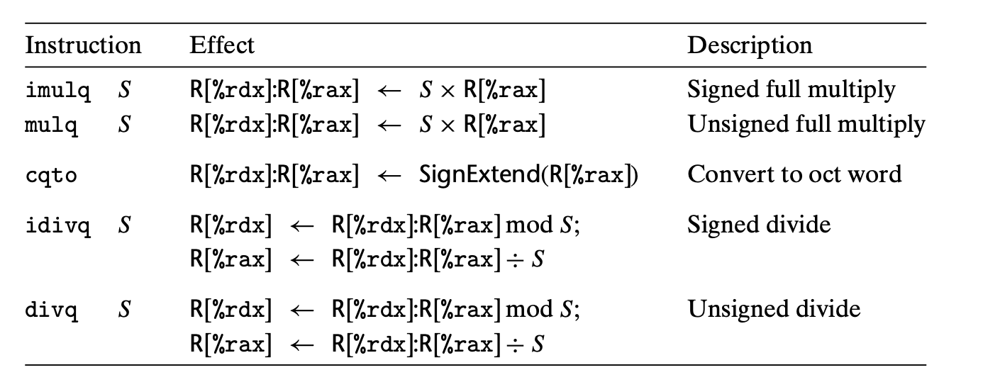

### 3.5.3 shift operations
shift amount 可以用 立即数 或者 single-byte register %cl 如果用寄存器；只能用%cl
最多可以移动255位

|Instruction|Effect|
|--|--|
|SAL k, D| D <- D << k|
|SHL k, D| D <- D << k|
|SAR k, D| D <- D >>A k|
|SHR k, D| D <- D >>L k|

左移都一样；算数右移补符号位；逻辑右移补0；

### 3.5.4 Discussion
大部分操作符都可以作用于unsigned或者two‘s-complement的数字；只有右移操作比较特别，对无符号和有符号数的操作不同。

### 3.5.5 Special Arithmetic Operations
multiplying two 64-bit signed or unsigned integers can yield a product that requires 128 bits to represent
x86-64 支持128位的operations；不过会马上将它转换到 double word quad word 等。
16-byte 也被称为 oct word
