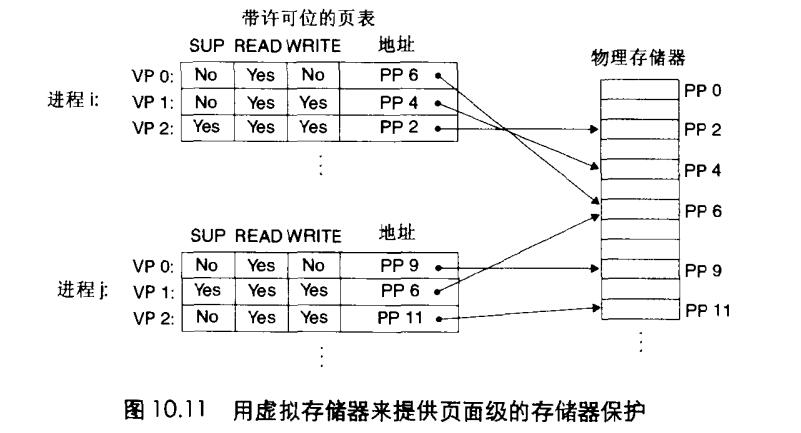

# Chapter.9 虚拟内存

---------------

## 虚拟内存作为内存保护工具

现代的计算机系统必须为操作系统提供手段来控制对内存系统的访问
- 不应该允许一个用户进程修改它的只读代码段。
- 不允许修改内核代码和数据结构
- 不允许读或者写其他进程的私有内存
- 不允许修改任何与其他进程共享的虚拟页面

观察上图,即可以在页表级对内存进行访问控制,每个`Page Table Entry`中添加了三个许可位  
- `SUP`:表示进程是否必须运行在内核(超级用户)下才能访问该页
- `READ`和`WRITE`控制读写权限

比如上图红,进程i在用户模式下可以访问VP0和VP1,但是不允许访问VP2

如果触发越权行为,就会抛出`段错误`

--------------

> Latex转Svg

https://www.latexlive.com/