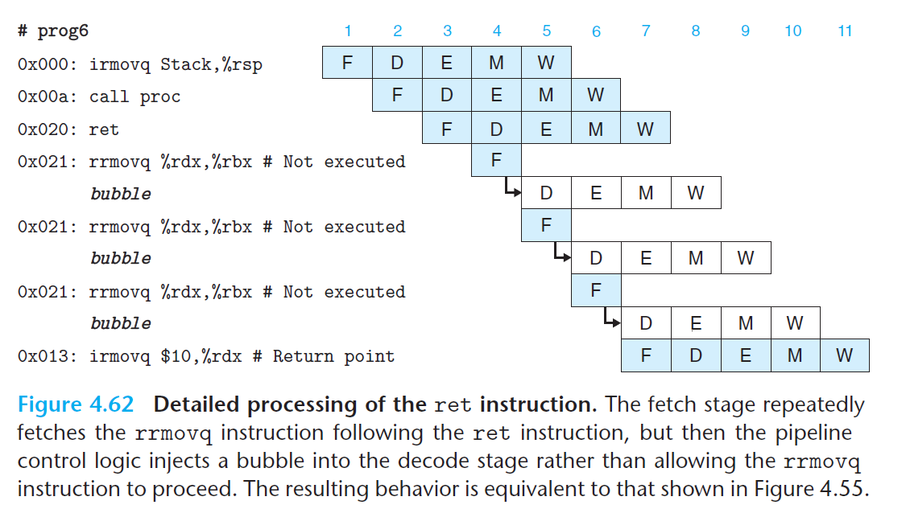
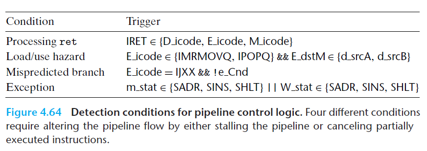

# Ch4 Processor Architecture

## 4.5 Pipelined Y86-64 Implementations

**Desired Handling of Special Control Cases**

Load / Use Hazard 冒险，写后读两条指令，将第二条指令阻塞在译码阶段，且在下一周期插入一个气泡，然后用转发来解决数据冒险，保持流水线寄存器 F 和 D 固定不变。

对于 `ret` 指令，流水线停止三个周期，直到 `ret` 指令经过访存阶段，读出返回地址。在实际过程中，`ret` 指令的处理更为复杂，下面的例子无法插入气泡暂停，只能交替取错误的指令并插入气泡。

分治预测错误时，当 `jmp` 指令在执行阶段就可以检测到预测错误，然后在下一个周期插入气泡，取消两条不正确的指已取指令。

对于异常指令，可以采取的措施有：

1. 禁止执行阶段中的指令设置条件码；
2. 往内存阶段插入气泡，禁止数据内存的写入；
3. 写回阶段的异常指令，暂停写回阶段，暂停流水线。

因此，异常指令的期望行为是：异常之前的指令都能正常执行完毕，异常指令后面的指令不影响程序员可见状态。

**Detecting Special Control Condition**

特殊流水线控制条件可通过下表进行判断。

