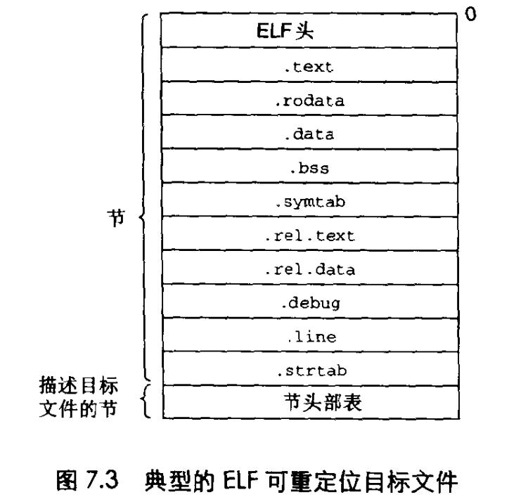

# Chapter.7 链接

- 1. 理解连接器将帮助你构造大型程序
- 2. 理解连接器将帮助你避免一些危险的编译错误
- 3. 理解链接将帮助你理解语言的作用域规则是如何实现的
- 4. 理解链接将帮助你理解其他重要的系统概念
- 5. 理解链接将使你能够利用共享库

--------------

## 编译器驱动程序

大多数编译系统提供`编译器驱动程序`,它代表用户在需要时调用语言预处理器、编译器、汇编器和链接器  
比如c语言中  
- 编写.c文件
- 编译成ASCII码的中间文件`.i`
- 翻译成汇编语言文件`.s`
- 汇编器将`.s`翻译成一个`可重定向目标文件` - `.o`
- 经过同样过程生成其他的`.o`
- 链接器程序`ld`将`.o`链接起来创建一个`可执行目标文件`

## 目标文件

目标文件有三种形式  
- 1. 可重定位目标文件 : 编译时与其他可重定位文件合并起来,创建一个可执行的目标文件
- 2. 可执行目标文件 : 其形式可以北直街复制到内存并执行
- 3. 共享目标文件 : 一种特殊类型的可重定位目标文件,可以在加载或者运行时被动态的加载进内存并链接

早期的可执行文件是`.out`  
现在`Linux`上仍然是`.out`

## 可重定位目标文件

图7-3是一个典型的ELF(Executable and Linkable Format)可重定位文件的格式.

ELF头以一个16字节的序列开始,这个序列描述了声称该文件得系统的字的大小和字节顺序。

剩下部分包含帮助链接器语法分析和解释目标文件的信息。

目标文件包含一下几个节  
- `.text` : 已编译程序的机器代码
- `.rodata` : 只读数据,比如printf语句中的格式串和开关语句(switch?)的跳转表
- `.data` : 已初始化的`全局和静态c变量`。`局部c变量`被保存在栈中,既不出现在`.data`节,也不出现在`.bss`节
- `.bss`(Block Storage Start/Better Save Space,更好的节省空间) : 未初始化的`全局和静态c变量,以及所有被初始化为0的全局或静态变量`(仅仅只是占位符)
- `.symtab` : 一个符号表,存放在程序中定义和引用的函数和全局变量的信息
- `.rel.text` : 一个`.text`节中位置的列表,链接时需要
- `.rel.data` : 被模块引用或定义的所有全局变量的重定位信息
- `.debug` : 一个调试符号表
- `.line` : 原始c源程序中的行号和`.text`节中机器指令之间的映射。
- `.strtab` : 一个字符串表,其内容包含`symtab和debug`节中的符号表

--------------

> Latex转Svg

https://www.latexlive.com/