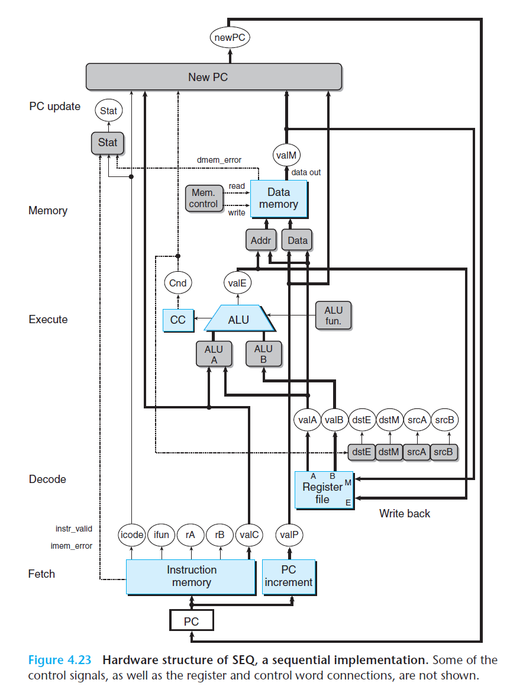
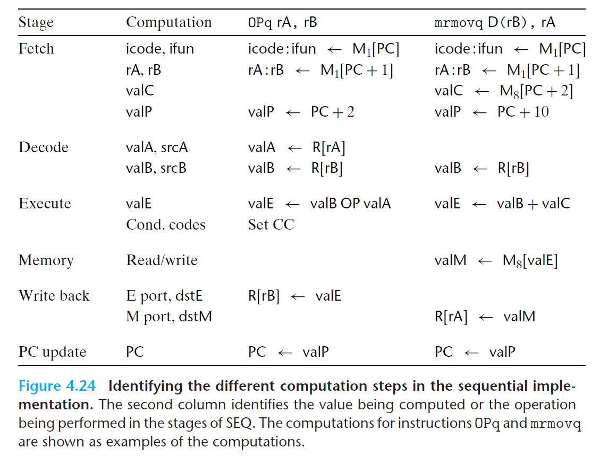

# Ch4 Processor Architecture

## 4.3 Sequential Y86-64 Implementations

**SQE 硬件结构**

硬件结构和指令执行的六个阶段的关联如图：

涉及到了 时钟寄存器、硬件单元（内存、ALU等）、控制逻辑块、字长宽度的数据连接线、字节宽度的数据连接线、单个位长的数据连接线。

其中每个阶段涉及到的计算如下：

**SQE 的时序**

SQE 包括了：

* 组合逻辑，不需要时序或控制，其根据数据产生输出并传播；

* 存储器设备，包括了时钟寄存器（程序计数器、条件码寄存器），随机访问寄存器（寄存器文件、指令文件、数据内存）；这些单元通过时钟信号来控制，包括读、写、整数运算产生的条件码等。

Y86-64 遵循了从不回读的规则来组织计算，**处理器从来不需要为了完成一条指令的指令而去读该指令更新的状态**，即指令不依赖本身的状态。

通过组合逻辑和时钟信号控制的存储器设备，可以控制 SEQ 的实现及计算，每次时钟由低变高时，处理器开始执行一条新的指令。

