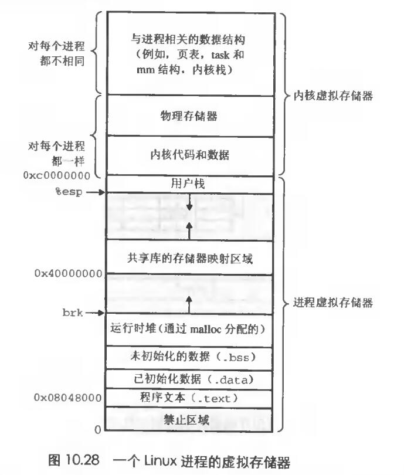

# Chapter.9 虚拟内存

---------------

## Linux内存系统

如上图,就是Linux中一个进程的虚拟内存结构,`内核虚拟内存`位于`用户栈`之上  

内核虚拟内存包含内核中的代码和数据结构,`不过有些区域被映射到了所有进程共享的物理页面`,比如共享内核的代码和全局数据结构.

Linux将虚拟内存组织成一些区域(也叫作段)的集合,一个区域(area)就是已经存在着的虚拟内存的连续片(chunk),这些页是以某种方式相关联的.

## 内存映射

Linux将一个虚拟内存区域与一个磁盘上的对象关联起来,来初始化这个区域的内容.这个过程被称为`内存映射`

`Linux文件系统中的普通文件`: 一个区域可以映射到一个普通磁盘文件的连续部分,例如一个可执行目标文件.当需要这部分时,CPU就会引用这部分页到物理内存.如果区域比文件大,就用零填充

`匿名文件`: 一个区域也可以映射到一个匿名文件,匿名文件由内核创建.包含的全是二进制0.CPU第一次引用这样一个区域内的虚拟页面时,内核就在物理内存中找到一个合适的牺牲页面,如果该页被修改过,就用二进制0来覆盖牺牲页面并更新页表.

一个虚拟页面被初始化了,它就在一个由内核维护的专门的`交换文件`之间换来换去,交换文件也称`交换空间/交换区域`

--------------

> Latex转Svg

https://www.latexlive.com/