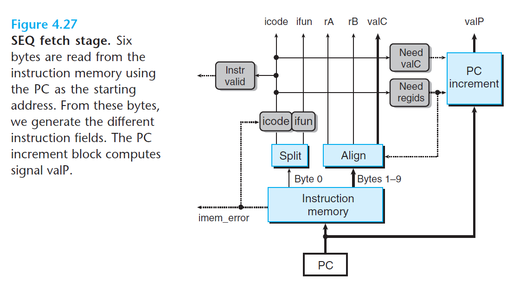
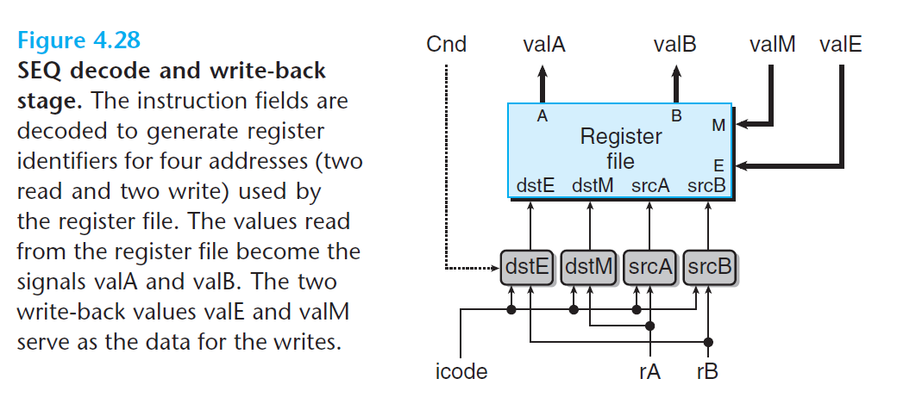

# Ch4 Processor Architecture

## 4.3 Sequential Y86-64 Implementations

**SEQ 各阶段的实现**

* 取指阶段

    1. 以 PC 地址作为第一个字节，然后从该单元读出十个字节；
    2. 第一个字节被分为两个 4 bits，分别为 icode 和 ifunc，然后检验地址合法性（非法则产生 `imem_error`），产生三个信号分别为：
        * `instr_valid` : 指令是否为合法的 Y86-64 指令；
        * `need_regids` : 指令是否包括寄存器指示符字节；
        * `need_valC`: 指令是否包含常数；
    3. 剩下的九个字节为寄存器指示符和常数的组合编码。

    

* 译码和写回阶段

    这两个阶段分别是是针对寄存器文件的读操作和写操作。

    寄存器文件有四个端口，分别是两个读端口（分别在 A 和 B 上），两个写端口（在 E 和 M 上），每个端口都有一个地址连接和一个数据连接，地址连接是一个寄存器 ID，数据连接为 64bit 长的线路（作为输出和输出）。

    

