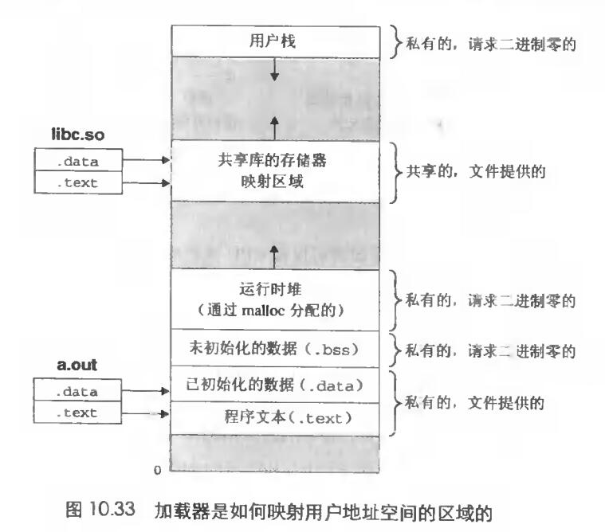

# Chapter.9 虚拟内存

---------------

## 共享对象

什么是共享对象,我们知道,进程可以把一个程序抽象成一段虚拟内存空间,但是不同的进程间可能有重合的部分

比如可能每个进程都会调用`printf`这个函数,如果每个进程中都保留这一部分的副本,就会产生明显的浪费.

一个内存可以被映射到虚拟内存的一个区域,要么作为`共享对象`,要么作为`私有对象`.

**如果一个进程把一个共享对象映射到虚拟空间的一个区域内,那么这个进程对这个区域的任何读写操作,对于其他也把这个共享对象映射到这个虚拟空间的其他进程而言也是可见的**

私有空间对其他进程是不可见的

共享空间存在的内存区域也叫`共享区域`  
私有空间存在的内存区域也叫`私有区域`

> 私有对象写时复制
>> 这个技术是这样的,在共享空间内存放私有对象的物理页  
>> **在不触发对这个空间进行写的条件下都可以正常的读**  
>> 触发写的时候会触发一个故障,这个故障会将物理页进行复制,在物理内存费共享区域创建这个页面的新副本  
>> 更新进程页表,指向那个新的副本

## 再看fork对象

当fork函数被`当前进程`调用的时候,内核为`新进程`创建各种数据结构,并分配给它一个唯一的`PID`。为了给这个新进程创建虚拟内存,他创建了当前进程的`mm_struct`、区域结构和页表的原样副本.它将两个进程中的每个页面都标记为只读,并将两个进程中的每个区域结构都标记为`私有的写时复制`

所以,当fork在新进程中返回时,新进程现在的虚拟内存刚好和调用fork时存在的虚拟内存相同,但是由于`写时复制`,所以,后面进行写操作时,就会创建新页面,也就为每个进程保持了私有地址空间的抽象概念

## execve函数

execve的作用是,将新程序直接替换当前的程序,即execve后面的程序逻辑直接被丢弃掉,这个子进程的地址空间会被逐一替换

根据这一节中,execve函数所执行的步骤有以下几个:  
- 删除已存在的用户区域: 删除当前进程虚拟地址的用户部分已存在的区域结构
- 映射私有区域: 微信程序的代码、数据、bss和栈区域创建新的区域结构。所有这些区域都是`写时复制`的
- 映射共享区域: 如果程序有和共享区域连接,也会触发映射到共享区域内
- 设置程序计数器(PC): 最后一件事情就是设置当前进程上下文中的程序计数器，使之指向代码区域的入口点。

--------------

> Latex转Svg

https://www.latexlive.com/