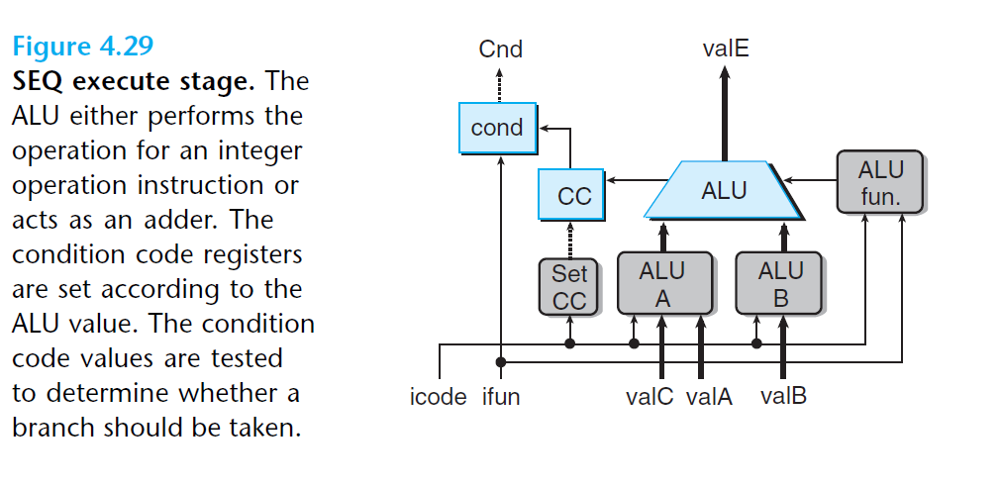
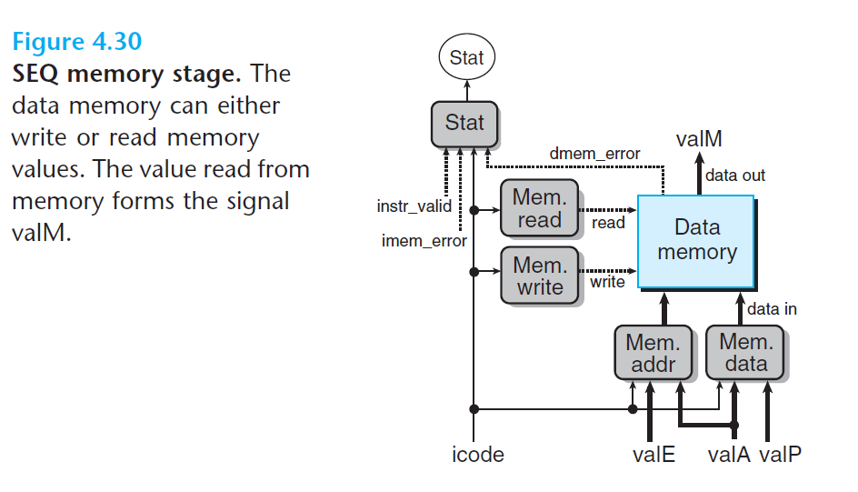
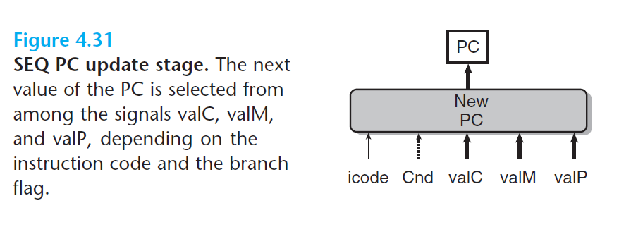

# Ch4 Processor Architecture

## 4.3 Sequential Y86-64 Implementations

**SEQ 各阶段的实现**

* 执行阶段

    执行阶段的核心为 ALU，ALU 根据 `alufun` 信号，对输入的 `aluA` 和`aluB` 进行逻辑运算或算数运算，ALU 的输出为 `valE`；其中：

    * `aluA` 的值的来源为 `valA` 、`valC`、或常数 `+8` 和 `-8`；
    * `aluB` 的值的来源为 `valB`；
    * ALU 每次运算会产生三个与条件码相关的信号：zero flag、sign flag、overflow flag；在执行与 `OPq` 指令时才设置条件码、产生一个 `set_cc` 的控制信号来决定是否更新条件码寄存器；
    * `cond`  硬件单元根据 条件码  和 `ifun` 来确定是否进行条件分支或数据传送，其产生信号`Cnd`；

    

* 访存阶段

    访存阶段由两个控制块产生内存地址和内存输入数据，依据读写控制信号`mem_read` 或 `mem_write`，进行读写操作；

    最后依据取值阶段产生的 `icode`、`imem_error`、`instr_valid` 值和数据内存产生的 `dmem_error` 信号，从指令执行的结果来计算状态码 `Stat`。

    

    

* PC 更新 阶段

    ```HCL
    word new_pc = [
        # Call. Use instruction constant
        icode == ICALL : valC;
        # Taken branch. Use instruction constant
        icode == IJXX && Cnd : valC;
        # Completion of RET instruction. Use value from stack
        icode == IRET : valM;
        # Default: Use incremented PC
        1 : valP;
    ];
    ```

    

    

