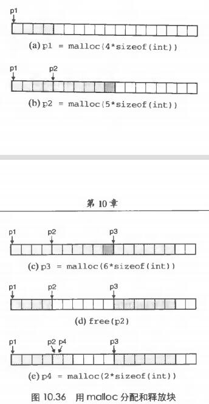
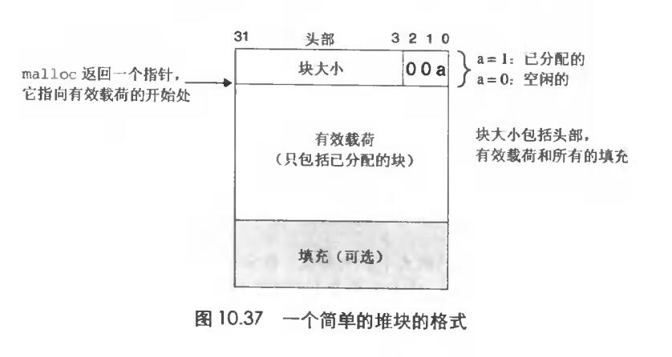
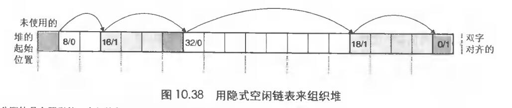

# Chapter.9 虚拟内存

---------------

## 动态内存分配

动态内存分配器维护着一个进程的虚拟内存区域,称为`堆`。堆向上生长,对于每个进程,内核维护着一个变量`brk`,读作`break`,指向堆的顶部

分配器将堆视为一组不同大小的`块`的集合来维护。每个块就是一个`连续的虚拟内存片(chunk)`,要么`已分配的`,要么`空闲的`.  

已分配的块显示的保留供应用程序使用,空闲的块可以用来分配。

分配器:  

- 显示分配器:
    - C语言: malloc,free
    - C++: new,delete
- 隐式分配器: 隐式分配器也称`垃圾回收器`,即`GC`

--------------

## malloc

malloc函数返回一个指针,指向大小至少为你指定的`size`字节的内存块,这个块会为可能包含在这个快内的任何数据对象类型`做对齐`

如果出现问题,比如程序要求的内存必须你内存还大,那么它就返回NULL  
- calloc可以把已分配的内存初始化为
- realloc可以用来改变一个已分配块的大小
- sbrk可以用来将内核的brk指针增加incr来扩展和收缩堆
- free来释放已分配的堆块

一次分配过程示例:  

**动态内存分配其实在应用程序中非常常见,目的是为了最大化内存利用率,比如很多语言的容器都涉及到扩容问题**

--------------

## 分配器的要求和目标

显示分配器必须在一些相当严格的约束条件下工作  
- 处理任意请求序列: 即free和malloc可以在任何地方
- 立即响应请求: 分配器必须立即响应分配请求,故不允许重新排列或者缓冲请求
- 只使用堆: 为了使分配器是可扩展的,分配器使用的任何非标量数据结构都要放在堆里
- 对齐块(对齐要求): 分配器必须对齐块,使其可以保存任何类型的数据对象
- 不修改已分配的块: 分配器只能操作或者修改空闲块,一旦被分配了,就不允许修改或者移动它了

--------------

## 碎片问题

`碎片`现象是造成`堆利用率低`的一个主要原因

分为`内部碎片`和`外部碎片`

内部碎片: 有的时候分配器可能会出现实际分配的内存比需要用到的大的情况  

外部碎片: 有的时候内部的堆已经无法分配内存了,程序向内核请求更多的虚拟内存来进行额外的分配.(比如虽然总数足够分配了,但是因为小空闲块太多,所以没有一个连续的空间来进行分配)

**所以分配器通常采用启发式策略来试图维持少量的大空闲块,而不是维持大量的小空闲块**

--------------

## 隐式空闲链表

在这种情况中,一个块是由一个字的`头部`,有效载荷,以及可能的一份额外的`填充`组成的.  
头部:  编码了这个块的大小,以及这个块是已分配的还是空闲的.  
空闲未标记: 头部最后一位是否是`1`  

头部后面跟的就是`有效载荷`,后面带着的是不用的填充,这部分可能是为了满足对齐要求,或者用来对付外部碎片

如上图所示,最后深蓝色的部分是空闲块,所有的空闲块可以通过链表连接起来,**所以可以通过遍历来得到所有的空闲块**

--------------

> Latex转Svg

https://www.latexlive.com/