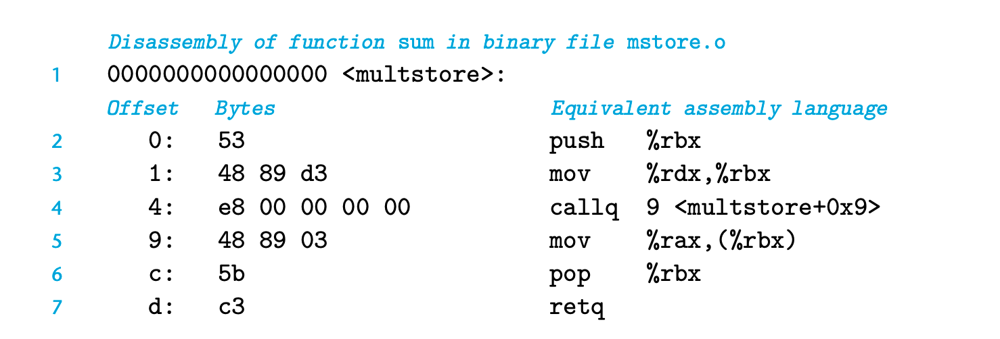

### 3.2.1 Machine-Level code
C语言则提供了一个模型 标记了不同的数据类型 和 内存布局
arrays & structures in c === contiguous collections of bytes

内存包含了：
1. 可执行的机器码
2. 一些操作系统所需要的信息
3. run-timestack 管理程序的的调用和返回
4. blocks of memory allocated by the user

虚拟内存 任何时候只有一部分区间是可访问的； 操作系统负责转化虚拟地址到无力地址
机器指令只处理非常简单的任务

### 3.2.2 Code Examples

```
long mult2(long, long);
void multstore(long x, long y, long *dest) {
    long t = mult2(x, y);
    *dest = t;
}
```

```
multstore:
  pushq   %rbx
  movq    %rdx, %rbx
  call    mult2
  movq    %rax, (%rbx)
  popq    %rbx
  ret
```

`53 48 89 d3 e8 00 00 00 00 48 89 03 5b c3` mstore.o

The machine has very little information about the source code from which these instructions were generated.

反汇编：
```
linux> objdump -d mstore.o
```




一些feature：
The instruction encoding is designed so that commonly used instructions and those with fewer operands require a smaller number of bytes than do less common ones or ones with more operands.
通过byte value标记指令
