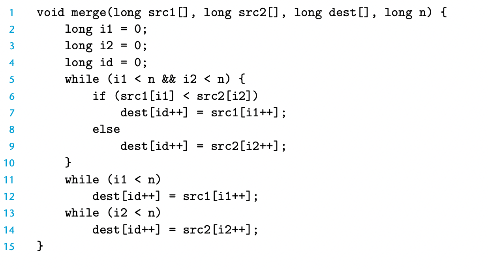

### practice problem 5.9



传统的merge需要三个循环

i1 i2 的预测大多数都是正确的，只有第一次才会是false。

但是line6的比较则不一定，因为数据是随机的

可以使用：
```c
    dest[id++] = src1[i1] < src2[i2] ? (i1++) : (i2++);
```

比原先的要快一些

但是自己测试的程序似乎没有？？

```cpp
#include <iostream>
#include <random>
#include <iterator>
#include <vector>
#include <algorithm>
#include <chrono>

using namespace std;

const int maxn = 100000000;

void merge2(vector<int> &a, vector<int> &b, vector<int> &c) {
    int i1 = 0;
    int i2 = 0;
    int i = 0;
    while (i1 < maxn && i2 < maxn) {
        auto v1 = a[i1];
        auto v2 = b[i2];
        c[i++] = v1 < v2 ? v1 : v2;
        i1 = i1 + (v1 < v2);
        i2 = i2 + (v1 >= v2);
    }
    while (i1 < maxn) {
        c[i++] = a[i1++];
    }
    while (i2 < maxn) {
        c[i++] = b[i2++];
    }
}

void merge1(vector<int> &a, vector<int> &b, vector<int> &c) {
    int i1 = 0;
    int i2 = 0;
    int i = 0;
    while (i1 < maxn && i2 < maxn) {
        if (a[i1] < b[i2]) {
            c[i++] = a[i1++];
        }
        else {
            c[i++] = b[i2++];
        }
    }
    while (i1 < maxn) {
        c[i++] = a[i1++];
    }
    while (i2 < maxn) {
        c[i++] = b[i2++];
    }
}

int main() {
    random_device rd;
    mt19937 engine{rd()};
    uniform_int_distribution<int> dist{1, 100};
    auto gen = [&dist, &engine]() {
        return dist(engine);
    };
    vector<int> a(maxn);
    vector<int> b(maxn);
    vector<int> c(2 * maxn);
    generate(begin(a), end(a), gen);
    generate(begin(b), end(b), gen);
    auto t1 = chrono::high_resolution_clock::now();
    merge1(a, b, c);
    auto t2 = chrono::high_resolution_clock::now();
    std::chrono::duration<double, std::milli> ms_double = t2 - t1;
    cout << ms_double.count() << "ms\n";

    t1 = chrono::high_resolution_clock::now();
    merge2(a, b, c);
    t2 = chrono::high_resolution_clock::now();
    ms_double = t2 - t1;
    cout << ms_double.count() << "ms\n";

    return 0;    
}
```


