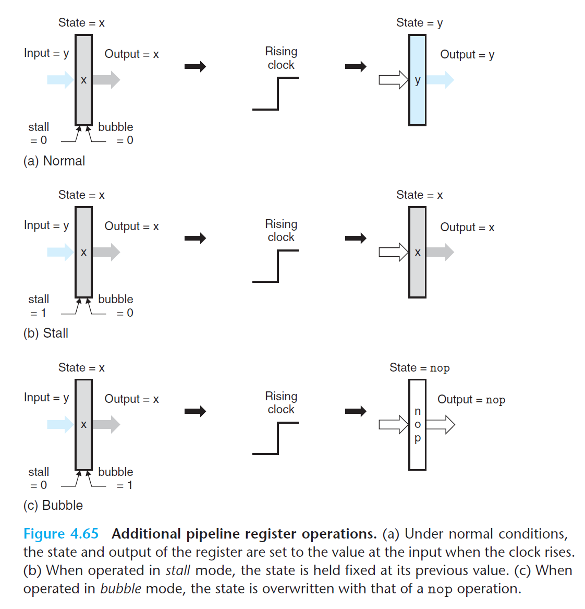
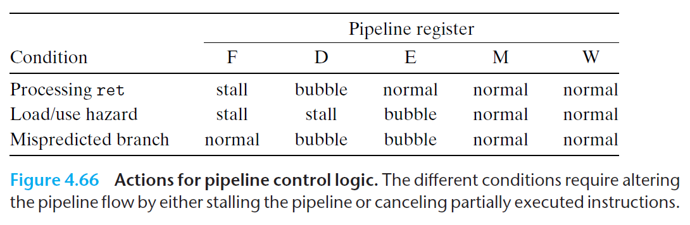

# Ch4 Processor Architecture

## 4.5 Pipelined Y86-64 Implementations

**Pipeline Control Mechanisms**

本节讲流水线控制逻辑中的相关控制信号，针对时钟寄存器加入两个控制输入：暂停（stall）和气泡（bubble），来实现流水线指令的阻塞逻辑。扩展图如下：

* Normal：正常情况下，stall = 0，bubble = 0，寄存器的状态和输出被设置为输入值；
* Stall：暂停情况下，stall = 1，bubble = 0，状态保持之前值不变；
* Bubble：气泡情况下，stall = 0，bubble = 1，状态改成 `nop`；

这些信号的改变，需要改变流水线寄存器中的 `icode` 和 相关目标操作数等。

例如，往流水线寄存器 D 中插入气泡，需要把 `icode` 设置为常数 `INOP`。

三种特殊情况下，流水线寄存器采取的行动如下：

