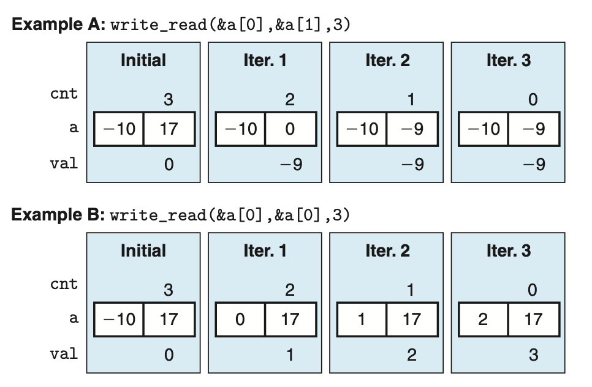
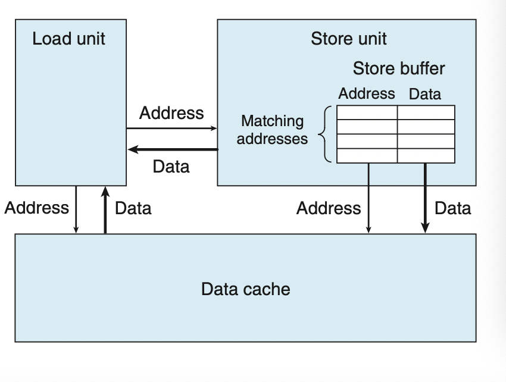

### 5.12.2 Store Performance

对于仅仅是一系列的store操作而言，实际上它并不会产生一些data dependency

只有store后面的load会有一些依赖

这两个分别是传入 &a[0], &a[1] 和 &a[0], &a[0]

前者的CPE有1.3 后者只有7.3

这个例子说明了一个现象：write/read dependency

现代CPU中有Store buffer 这里存放在那些正在处理但是没有完成的存储动作。

这里的完成指update data cache

当一个load指令发生时，他先查找store buffer有没有对应的地址，如果有，则直接取出相应的数据

