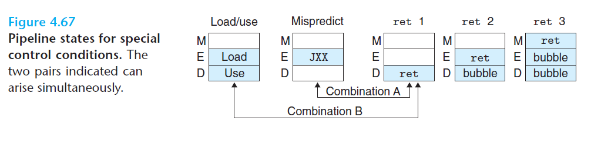
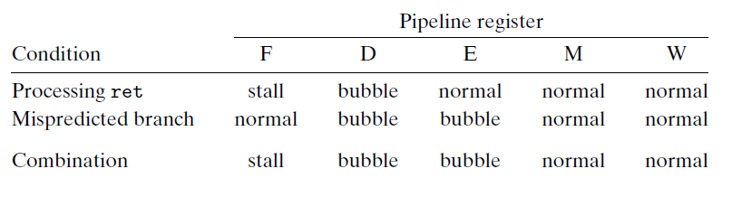
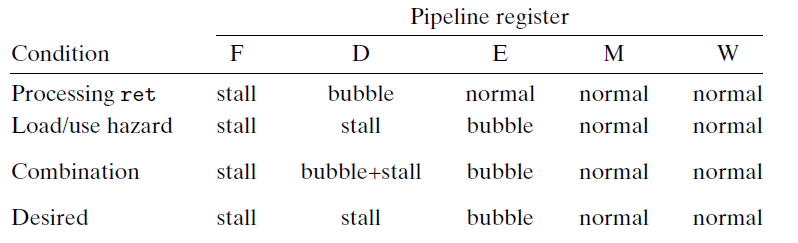
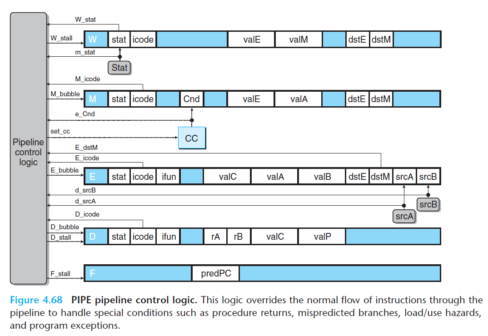

# Ch4 Processor Architecture

## 4.5 Pipelined Y86-64 Implementations

**Combination of Control Conditions**

之前的流水线假定了单个时钟周期内最多只能有一个特殊情况。几种特殊情况的组合情况如下图：

有几种特殊情况是互斥的，存在两种组合如下：

* 组合 A：执行阶段是不选择分支的跳转指令，译码阶段有一条 `ret` 指令，该`ret` 指令位于不选择分支的目标出，这种组合的时候是流水线预测失误，需要取消 `ret` 指令。

    这种情况和指令分支预测错误相似，PC 会选择跳转指令后面那条指令的地址，不需要读流水线寄存器 F 的预测 PC 值，因此流水线可以处理这种情况，具体如下表。

    

* 组合 B：`Load / Use hazard` 会加载寄存器 `%rsp` ，然后`ret` 指令会使用 `%rsp`作为源操作数，从栈中弹出返回地址，这种情况下，`ret` 指令需要阻塞在译码阶段。

    按照下表，需要暂停 `ret` 指令，并且在 `ret` 指令的译码阶段中插入一个气泡（该指令需要推迟一个周期）来解决这种问题，但是 PIPE 流水线逻辑无法同时处理以上两组动作。（这个例子是 PIPE 实现中的一个特例）

    

**Control Logic Implementation**

整体的流水线控制逻辑如下图。根据流水线寄存器和流水线阶段的信号，控制逻辑产生流水线寄存器的暂停和气泡控制信号，同时也决定是否要更新条件码寄存器。

