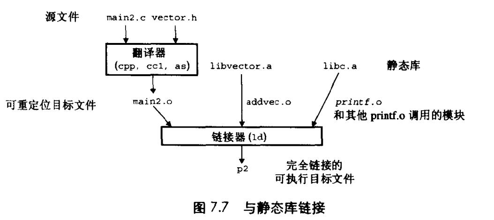

# Chapter.7 链接

- 1. 理解连接器将帮助你构造大型程序
- 2. 理解连接器将帮助你避免一些危险的编译错误
- 3. 理解链接将帮助你理解语言的作用域规则是如何实现的
- 4. 理解链接将帮助你理解其他重要的系统概念
- 5. 理解链接将使你能够利用共享库

--------------

## 与静态库链接

所有编译器都提供了一种机制,即将所有相关的目标模块打包成一个单独的文件,称为`静态库(static library)`,它也可以用做`链接器的输入`  
当链接器构造一个输出的可执行文件时，它只拷贝静态库里被应用程序引用的目标模块。

为什么系统要支持库?  
- 例如一组广泛的IO、串操作、整数算术函数等，有一些方法是通用的。比如`lib.a`库，对每个用户而言都是可用的  
- `libm.a`库,定义了一组广泛的算术函数,比如`sin、cos、sqrt`
- 将通用的与应用程序解耦,降低损耗

在Unix系统中,静态库一般以一种`存档`的特殊文件格式存放在磁盘中。存档文件由`.a`标识

### 创建库

假设我们想做一个叫`libvector.a`的静态库  
为了创建该库,需要使用AR工具  
```
unix> gcc -c addvec.c multvec.c
unix> ar rcs libvector.a addvec.o multvec.o 
```

为了使用这个库,我们可以编写一个应用,来调用addvec`或vector.h里定义的libvector.a中例程的函数原型`

```cpp
/*main2.c*/
#include<stdio.h>
#include"vector.h"

int x[2] = {1,2};
int y[2] = {3,4};
int z[2];

int main(){
    addvec(x,y,z,2);
    printf("z = {%d %d}\n",z[0],z[1]);
    return 0;
}
```

为了创建这个可执行文件,我们将编译和链接输入文件`main.o`和`libvector.a`  
```
unix> gcc -O2 -c main2.c
unix> gcc -static -o p2 main2.o ./libvector.a
```

`-static`参数告诉编译器驱动程序,链接器应该构建一个完全链接的可执行目标文件  
从链接到可执行文件的过程如下图所示  


### 链接器如何使用静态库来解析引用

注意,链接器命令中必须把几个被链接库的顺序摆放正确

## 重定位

一个链接器完成了符号解析这一步，它就把代码中的每个符号引用和确定的一个符号定义联系起来。  
重定位由两步组成  
- `重定位节和符号定义`
- `重定位节的符号引用`


--------------


> Latex转Svg

https://www.latexlive.com/