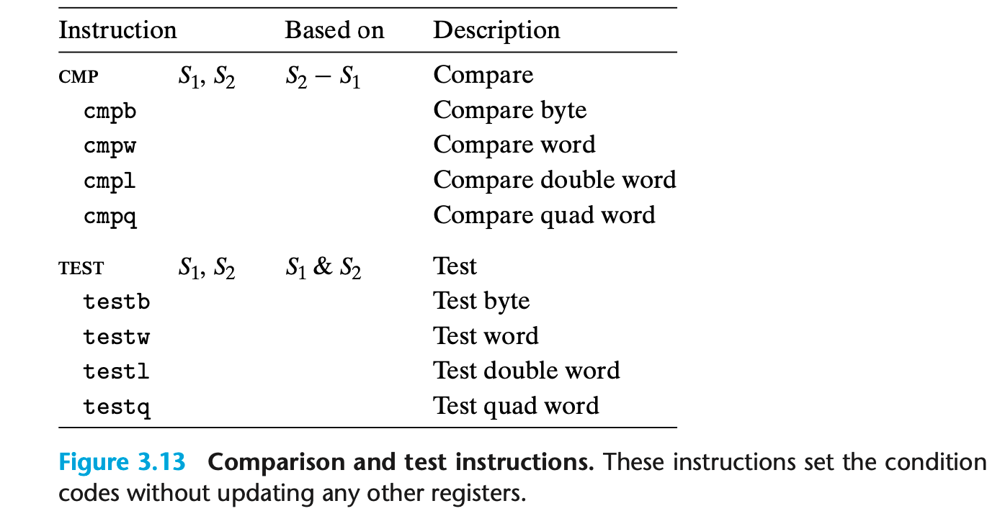
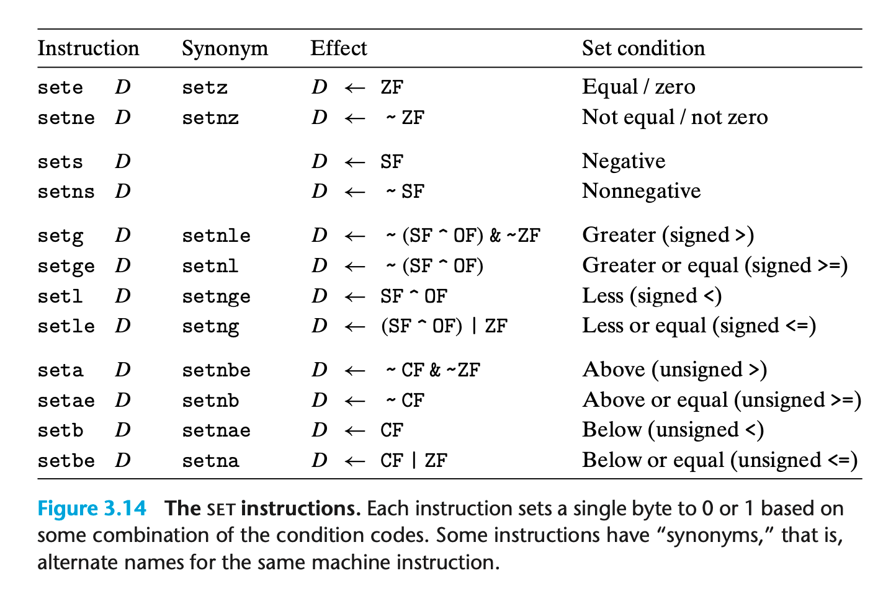
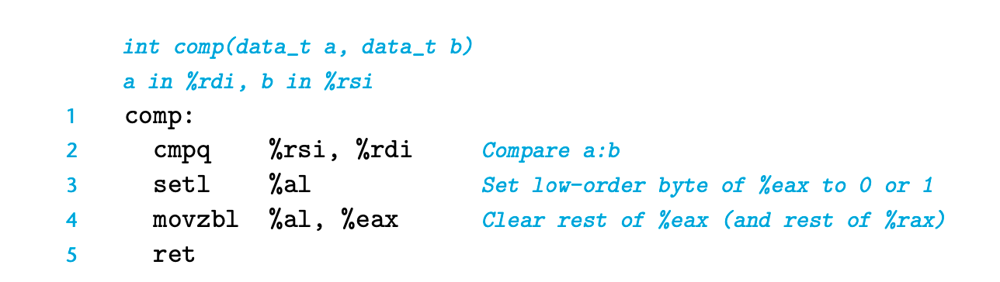

### 3.6.1 Condition Codes

CPU 保留一系列 condition code 寄存器；存储最近一次逻辑或算术运算的特征； 可以用于做条件分支

CF: Carry flag 是否产生进位
ZF: Zero flag 是否产生0
SF: Sign flag 是否产生负数
OF: Overflow flag 是否产生补码的溢出

`leaq`只做地址运算 不会更新寄存器 其他操作都会更新寄存器

### 3.6.2 Accessing the Condition Codes

* 根据条件码的组合，将某个字节置0或置1
* 用于条件跳转到程序的其他部分
* 用于有条件的传输数据

