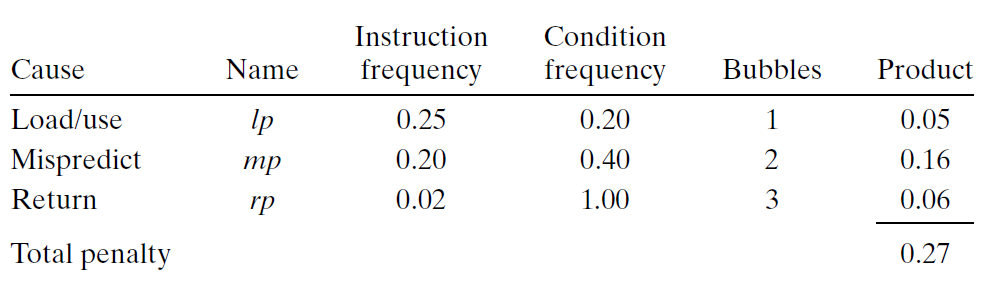

# Ch4 Processor Architecture

## 4.5 Pipelined Y86-64 Implementations

**4.5.9 Performance Analysis**

CPI （Cycle Per Instruction）用来量化特殊处理时候的性能。计算方式为，某个阶段一共处理了 $C_i$ 条指令和 $C_b$ 个气泡，处理器一共大约需要 $C_i + C_b$ 个时钟周期来执行 $C_i$ 条指令（忽略了启动流水线的周期），$CPI$  估计如下：
$$
\mathrm{CPI}=\frac{C_{i}+C_{b}}{C_{i}}=1.0+\frac{C_{b}}{C_{i}}
$$

$$
\mathrm{CPI}=1.0+l p+m p+r p
$$

* $lp$ ：load penalty，使用 load / use hazard 造成暂停插入气泡的平均数；
* $mp$： mispredicted branch penalty，指令分支预测错误取消是插入气泡的平均数；
* $rp$ : return penalty，由于 `ret` 指令造成暂停时插入气泡的平均数。

书上的一个统计为：

可以看到，分支预测错误是影响性能最重要的因素。

