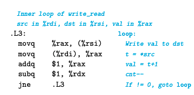

这两种

`write_read(&a[0], &a[1], 3)` 和 `write_read(&a[0], &a[0], 3)`

不同性能的原因需要我们注意到`store buffer`

这个buffer可以使得一系列的鞋操作可以立刻执行，而不需要等待cache真正更新，当一个load发生时，先检查store buffer如果没找到再去从cache中找..

对于`write_read`这个函数，gcc生成了如下的代码:

`movq %rax, (%rsi)`被转化成两个操作：s_addr:计算store的地址，创建store buffer的入口，s_data则是把这个entry的值填上。

这两个指令是否是独立的是十分关键的。

另外，在图的右侧又一些箭头表示先后的依赖关系，其中load 需要先检查store buffer的entry，所以它和s_addr间有一个依赖，最后一个是load 和 s_data之间，这个依赖是condition的，如果这两个mov的地址不相同则没有依赖关系。

那么此时我们就知道为什么，这个write_read 函数在两个地址相同时的性能不佳了，如果地址不同， load 和 store 可以独立的执行。否则critical path中需要多一个操作。

