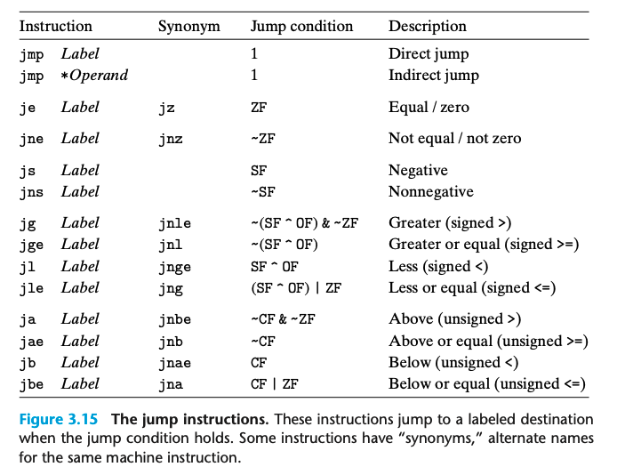

### 3.6.3 jump instructions
一般情况下指令是按照顺序运行的。
而jump指令给了我们分支的能力；可以让我们跳转到一个新的地方运行程序。
跳转的位置我们用一个label来标记。

```assembly
    movq $0,%rax
    jmp .L1
    movq (%rax),%rdx
.L1:
    popq %rdx
```


* direct jump ｜ 基于label jump
`jump .L1`
* indirect jump ｜ 基于 register或者memory jump 用*表示
`jump *(%rax) jump *%rax`

jump 也可以根据条件进行；命名和SET指令其实是一样的。
Condition Jump 必须是直接的。

### 3.6.4 Jump Instruction Encodings
relative: 也将目标指令的地址与紧跟在跳转指令后的那条指令的地址之差作为编码