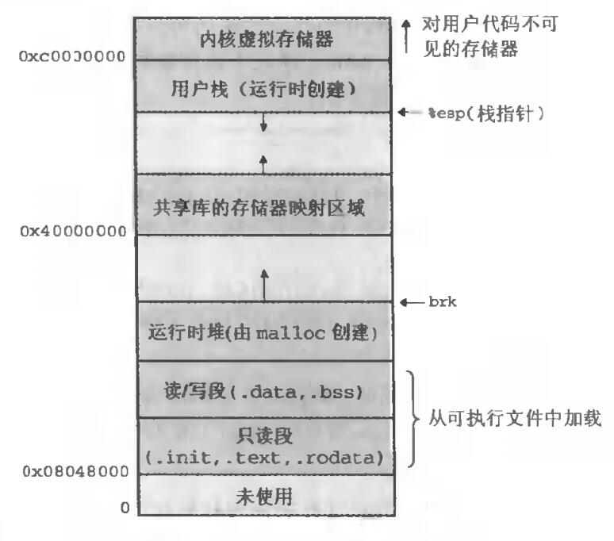
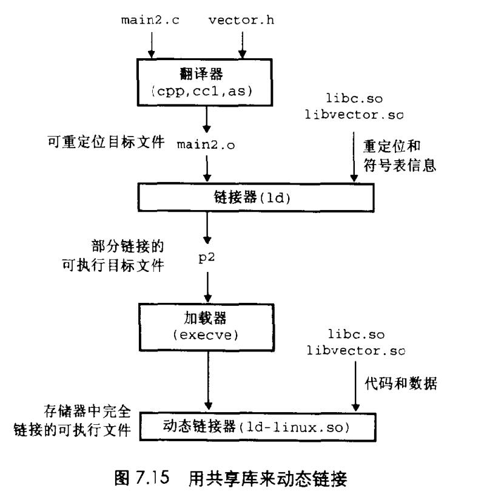

# Chapter.7 链接

- 1. 理解连接器将帮助你构造大型程序
- 2. 理解连接器将帮助你避免一些危险的编译错误
- 3. 理解链接将帮助你理解语言的作用域规则是如何实现的
- 4. 理解链接将帮助你理解其他重要的系统概念
- 5. 理解链接将使你能够利用共享库

--------------

## 加载可执行目标文件

当我们尝试加载一个可执行目标文件时,会调用某个驻留在存储器中称为`加载器`的操作系统弄代码来运行它  
加载器将可执行目标文件中的代码和数据从磁盘复制到内存中  
然后通过跳转到程序的第一条指令或`入口点`来运行该程序

> 内存五大区

每个程序都有一个内存映像，类似于上图,代码区放在下面,运行时堆在数据段之后,通过`malloc`库往上增长.  
堆后面的区域是为共享模块保留的,用户栈向下增长.用户栈上方是`内核`中的代码和数据  

只读段里面保存代码

## 动态链接共享库

如果我们用到的库后续可能更新,最好使用动态链接库。另一个问题是,如果`printf`这类的函数如果复制到每个运行进程的内存中,会造成极大地浪费  

`共享库`是一个目标模块,在运行或加载时,可以加载到任意的内存地址.并和一个需要它的程序连接起来,这个过程是由一个`动态链接器`的程序完成的.  
Linux一般是`.so`  
Windows一般是`DLL`

### 动态链接库的应用

- 分发软件  类似于代码热更新
- 构建高性能Web服务器

C语言提供了打开对应链接库的方法,

--------------

> Latex转Svg

https://www.latexlive.com/