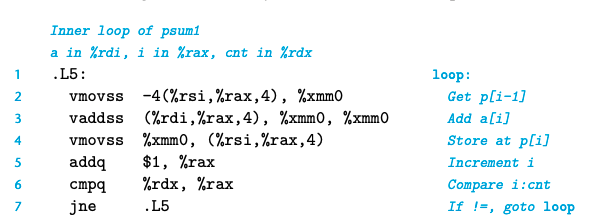

## 习题5.11

prefix-sum 的CPE高达9，而浮点加法只有三个周期的延时，通过汇编解释原因：

因为要读p[i - 1], 然后p[i] = a[i] + p[i - 1]

下一次必须等到这一轮完成才能进行，所以花费的额外时间多，
相当于critical path上 有 load + add + store

## 5.13 Life in the Real World: Performance Improvement Techniques

basic strategies for optimizing program performance:

- High-level design: choose appropriate algorithms and data strctures.
- Basic coding principles: avoid optimization blockers. 比如function接受两个指针，*x, *y, 考虑他们相同指向的情况;减少不必要的访问memory，如使用temporary variable 存储。
- Low-level optimizations: structure code to take advantage of the hardware capabilities.
    - unroll loops: 每次在循环体内尽可能多的(和硬件匹配)进行运算，而不是一个循环加1次
    - 找到可以使得指令层面并行的方法
    - 使用三目运算符用cmov替换jle, jne等等

