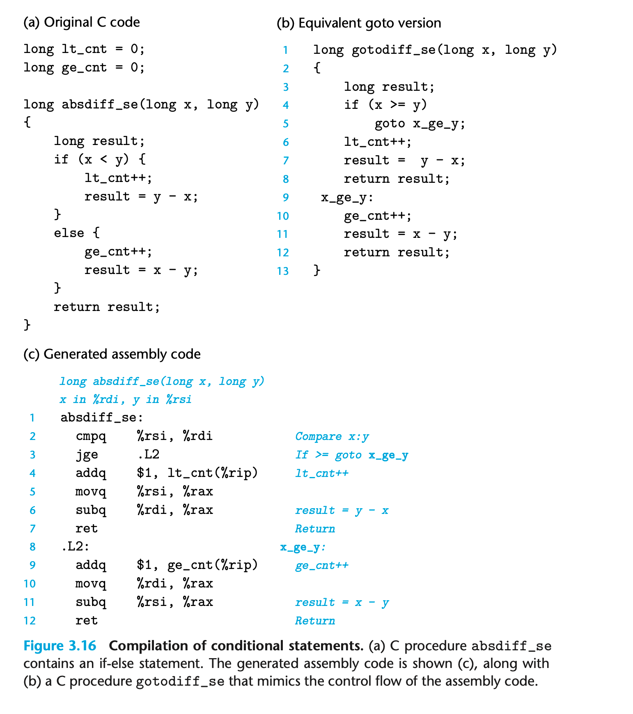

### 3.6.5 Implementing Conditional Branched with Conditional Control

C语言条件分支的逻辑通常用 conditional and unconditional jump 实现。


一般的if-else都可以写成goto的模式 翻译成汇编其实和goto的形式是接近的

```
if (test-expr) 
    then-statement
else
    else-statement
```

```
    t = test-expr; 
    if (!t)
        goto false;
    then-statement
    goto done;
false:
    else-statement
done:
```

### 3.6.6 Implementing Conditional Branches with Conditional Moves
transfer of control 是传统的方式但是对现代处理器架构不友好
另一种策略是 transfer of data

```
long absdiff(long x, long y)
{
    long result;
    if (x < y) result = y - x; 
    else result = x - y; 
    return result;
}
```

```
absdiff:
  movq %rsi, %rax
  subq %rdi, %rax
  movq %rdi, %rdx
  subq %rsi, %rdx
  cmpq %rsi, %rdi
  cmovge %rdx, %rax
  ret
```