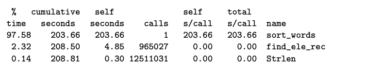
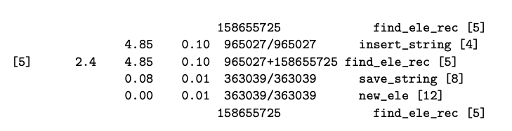

## 5.14 Identifying and eliminating performance bottlenecks

使用 code profilers 可以帮助我们在大型程序中找到需要优化的部分。

### 5.14.1 Program Profiling

Unix 系统提供grof. 这个程序产生两种信息，首先它可以分析出每个function执行了多少时间。第二，它可以计算出函数被调用了多少次

如，我们有一个名为`prog.c`的程序，参数为`file.txt`

    $gcc -Og -pg prog.c -o prog
    $./prog files.txt
    $gprof prog

第二步执行一般会比实际慢一点

可以看到sort_name执行了1次，但是耗费了203秒，而strlen执行1000万次，却就消耗了0.3秒，

gprof还给出了函数调用的历史:

这里面显示了find_ele_rec的调用信息，158655725是自己递归调用的次数，965027是是insert_string调用它的次数等等。

