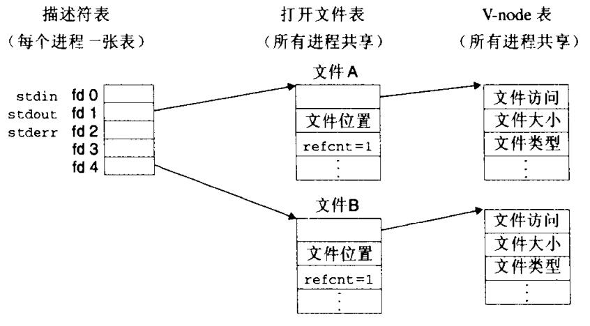
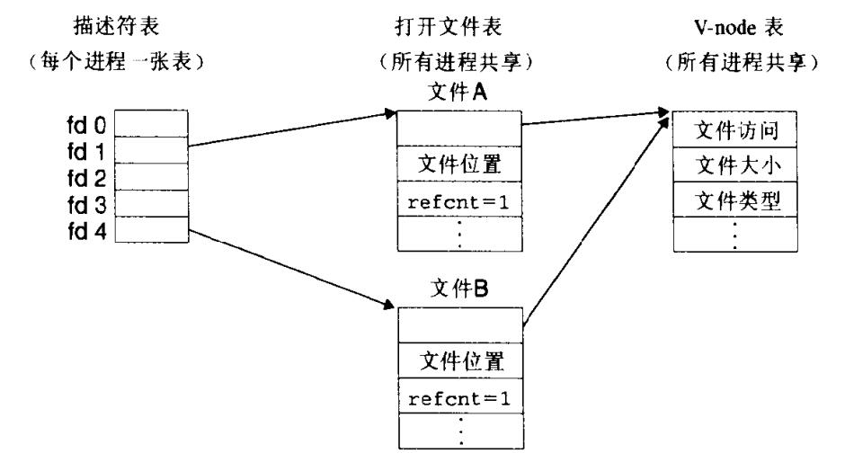
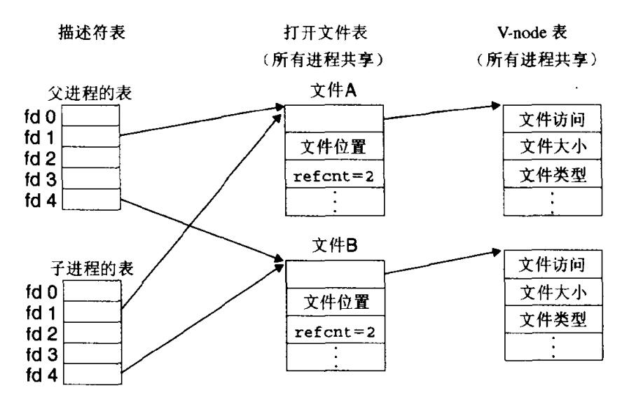

# Chapter.10 系统级I/O

--------------

## 10.8 共享文件

- **描述符表**: 每个进程都有它独立的描述符表,它的表项是由进程打开的文件描述符来索引的
- **文件表**: 打开文件的集合是由一张文件表来表示的,所有的进程共享这张表.每个文件表的表项组成,包括当前的文件位置.`引用计数`,以及一个指向`v-node`表中对应表项的指针
- **v-node表**: 同文件表一样,所有的进程都共享这张v-node表。每个表项包含stat结构中的大多数信息,包括st_mode和st_size成员

>  没有共享文件的情况下:  


> 有共享文件的情况下:  


> fork的条件下是会共享文件表项的



## I/O重定向

Unix Shell提供了I/O重定向操作符,允许用户将磁盘文件和标准输入输出联系起来

> 即刷题时可以把`printf`这一类的函数直接写入到文件中,而不需要打开文件  
> 或者`scanf`从文件中读出数据,同样不需要打开  

比如程序 `myApp`

```shell
Unix> myApp > foo.txt
```

Unix IO是在操作系统`内核`中实现的。应用程序可以通过open、close、lseek、read和write这样的函数来访问Unix I/O。

但是对于网络部分,Unix对网络层的抽象是一种`套接字`的文件类型。套接字也是用文件描述符来引用的，在这种情况中被称为`套接字描述符`,应用进程通过读写套接字描述符来运行在其他计算机上的进程通信,而这种通信方式是有限制的  
- 限定一: 输入函数跟在输出函数之后。中间必须插入某些函数
- 限定二: 输出函数跟在输入函数之后。中间也必须插入某些函数  

> 作者说尽量避免使用系统I/O函数来进行输入输出,尽量使用RIO之类的


--------------


> Latex转Svg

https://www.latexlive.com/