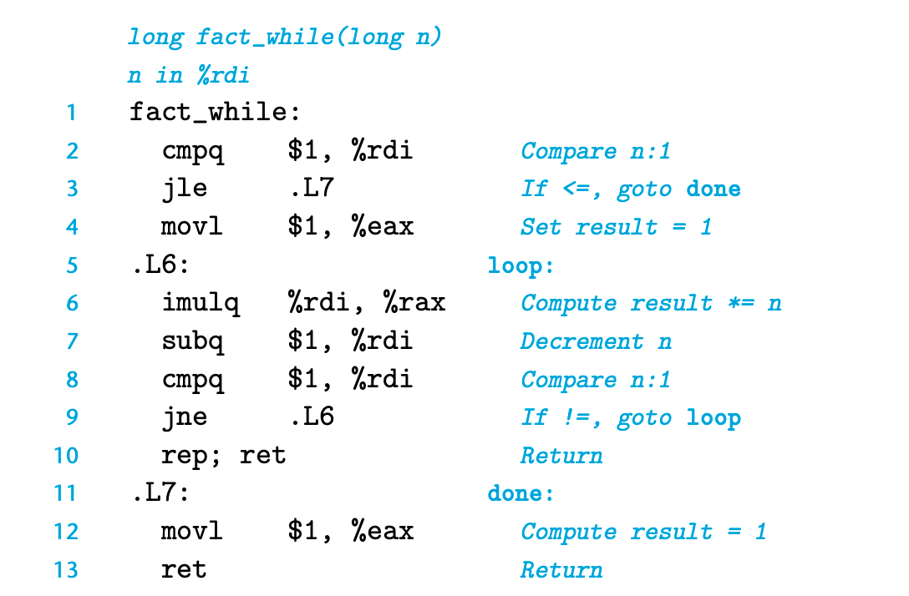
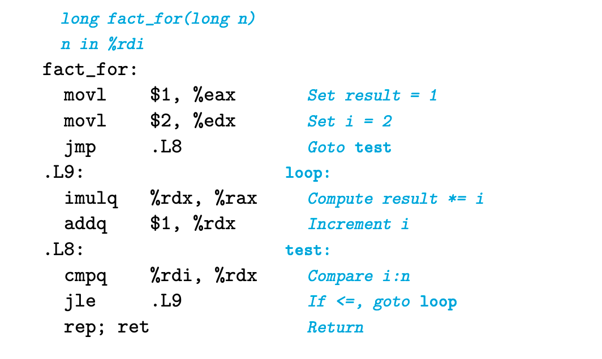

### 3.6.6 Implementing Conditional Branches with Conditional Moves
为什么 data transfer 比 control transfer 效率更高呢？
这个和现代处理器架构的流水线设计有关。指令是被分割成多个stage处理的，通过重叠连续指令的不同步骤，提高处理器吞吐。
但是如果遇到了分支，我们就没有办法实现确定分支走向直到我们对条件进行求值。当然处理器实际上会对分支进行预测，但每次预测失败就会浪费15-30个周期的计算。

但是如果采用 conditional moves； 处理器的流水线就更容易被完全利用。

但并不是每个情况都可以利用 conditional moves 的。 如果其中一个分支会产生error或者副作用，就会有问题。

### 3.6.7 Loops
C 提供了好几种循环结构： do-while, while, for 等等。

循环的本质就是下面这样
```cpp
loop:
    body-statement t = test-expr; 
    if (t)
        goto loop;
```

```
fact_do:
  movl $1, %eax
.L2:
  imulq %rdi, %rax
  subq $1, %rdi
  cmpq $1, %rdi
  jg .L2
  rep; ret
```



总之有几种不同的翻译方式。