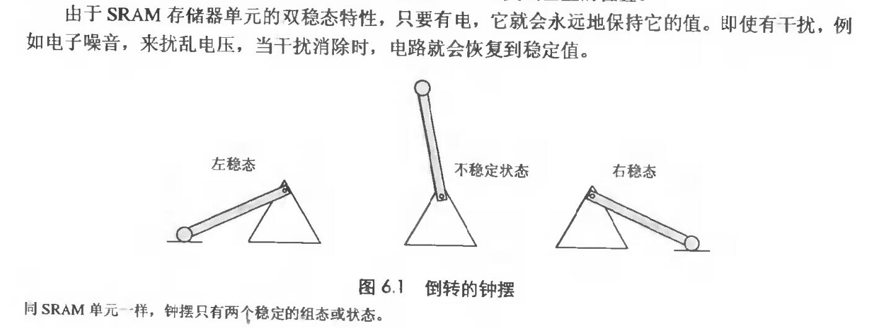
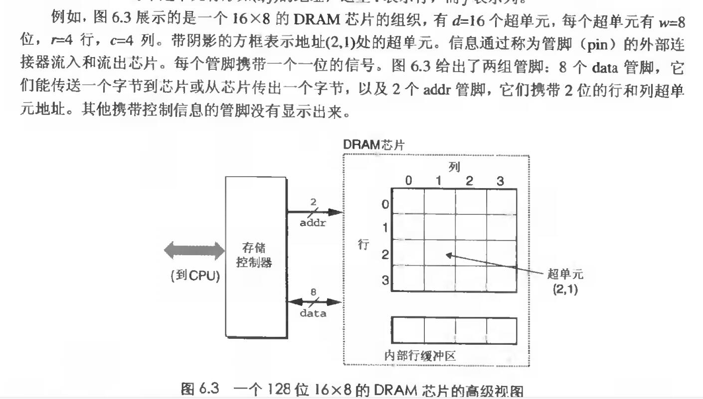
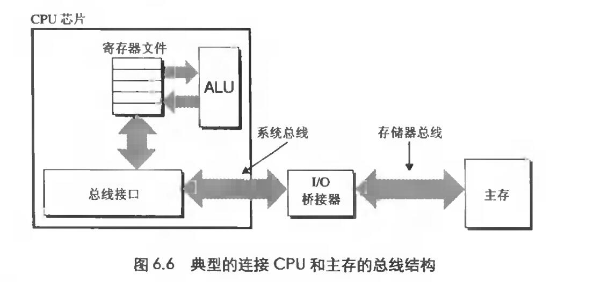

# Chapter.6 存储器层次结构

--------------

## 前言

CPU执行指令,存储器系统为CPU存放指令和数据  
存储器系统是一个层次结构

## 存储技术

### 随机访问存储器(random-access memory,RAM)

分为两类: 静态和动态  
静态RAM称为(SRAM),动态RAM称为(DRAM)  
SRAM速度大于DRAM,但也贵很多  
SRAM可以在CPU上,也可以不再CPU上  
DRAM用来做主存或者图形系统的帧缓冲区  

#### SRAM

SRAM将每个位存储在一个`双稳态`存储单元里。每个单元是用一个六晶体管电路来实现的。  
这个电路有这么一个特征,即它可以`无限期地保持在两个不同的电压配置或状态之一,但其他任何状态都还是不稳定的`  
类似于一个摇动的钟摆  

#### DRAM

DRAM将每个位存储为对电容的充电  
DRAM容易在泄漏电流的情况下出现差错,以及对光敏感,但是存储器系统也有一定的弥补方案

#### 常规的DRAM

DRAM芯片中的单元(位)被分成d个`超单元`  
每个超单元都是由w个`DRAM`单元组成的

超单元被组织成`r行c列`的长方形矩阵,记rc=d  
则`d*w`就是DRAM总共存放的大小

读取超单元内容时,是将实际内容读入到行缓冲区,然后由行缓冲区交给超单元

#### 非易失性存储器

如果断电,DRAM和SRAM就会丢失信息  
非易失性存储器即使在关电后,仍然保存着它们的信息  
称为`ROM(read-only memory)`只读存储器

#### 访问主存

数据流通过称为`总线(bus)`的共享电路在处理器和DRAM主存之间来来回回,CPU和主存之间的数据传送流程被称为`总线事务`

读事务: 从主存传数据到CPU  
写事务: 从CPU到主存

如上图所示,系统总线将IO桥接器连接到CPU上,IO桥接器连接到主存上

IO桥接器将系统总线的电信号翻译成存储总线的电信号

#406

--------------

> Latex转Svg

https://www.latexlive.com/