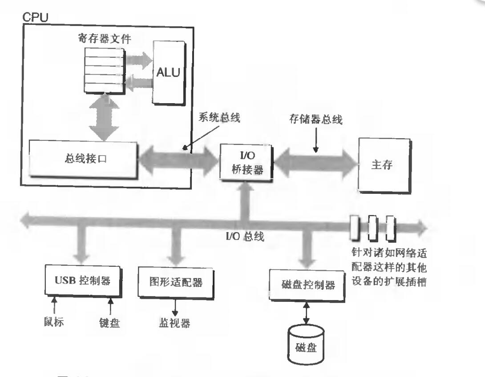
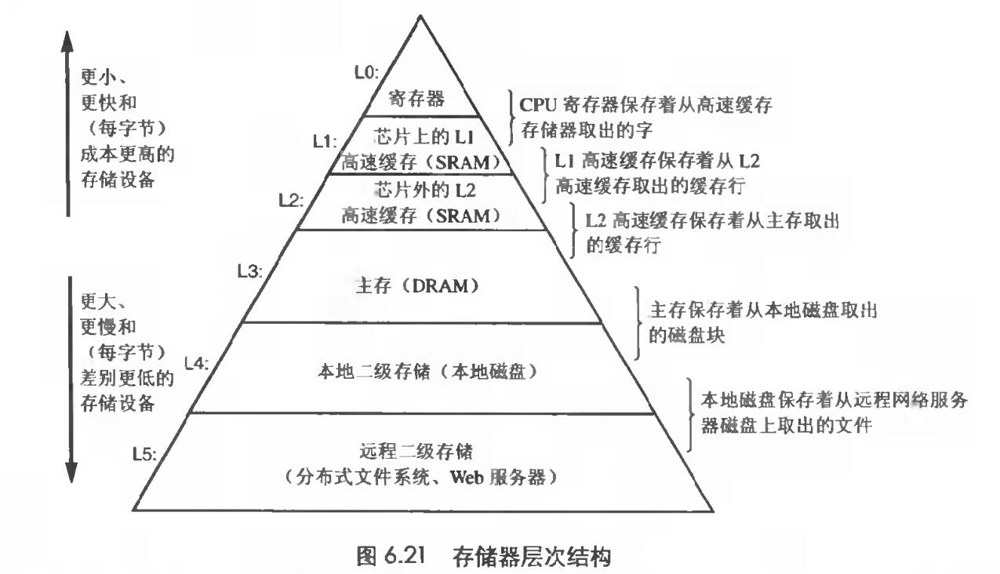

# Chapter.6 存储器层次结构

--------------

## 磁盘存储

磁盘在构造上比DRAM和SRAM低了上万倍

### 磁盘构造

这里讲的是以前的机械硬盘

## 访问磁盘

> IO总线  

图形卡、监视器、鼠标、键盘和磁盘等IO设备,都是通过`PCI(Peripheral Component Interconnect,外围设备互联)`总线这样的IO总线连接到CPU和主存。  

IO总线可连上CPU IO桥接总线




如上图所示,各种适配器通过io总线连到IO桥接器上

IO总线提供了扩展槽,可以插入网络适配器等设备

## 局部性

- 时间局部性  
- 空间局部性

局部性体现在编程中,**具有良好局部性的程序性能会比局部性差的程序更快**


一个简单的例子

```cpp
vec[m][n]  

for(int i=0;i<m;++i){
    for(int j=0;j<n;++j){
        vec[i][j];
    }
}

for(int i=0;i<m;++i){
    for(int j=0;j<n;++j){
        vec[j]][i];
    }
}
```

假设页表大小只有数组中的一行

那么行优先访问(第一个)就会触发`m*n`次页表置换  
列优先访问只会触发`m`次页表置换


## 存储器层次结构



#425

--------------


> Latex转Svg

https://www.latexlive.com/