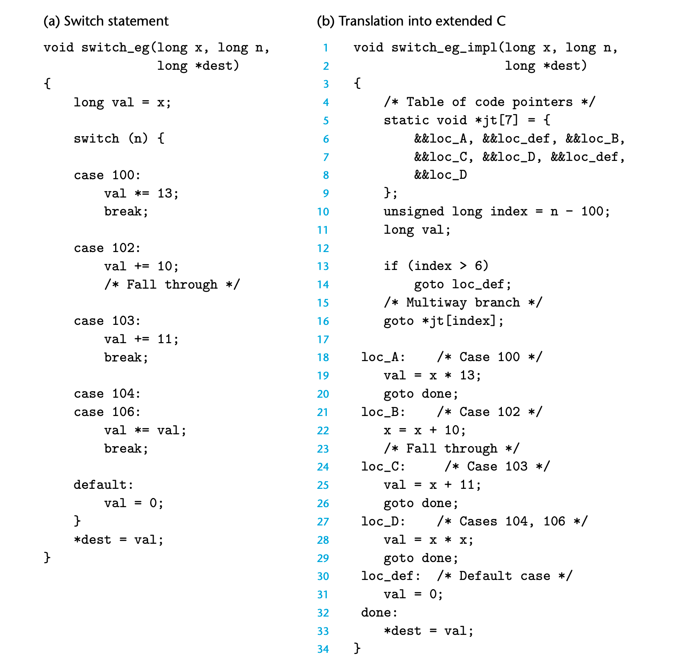
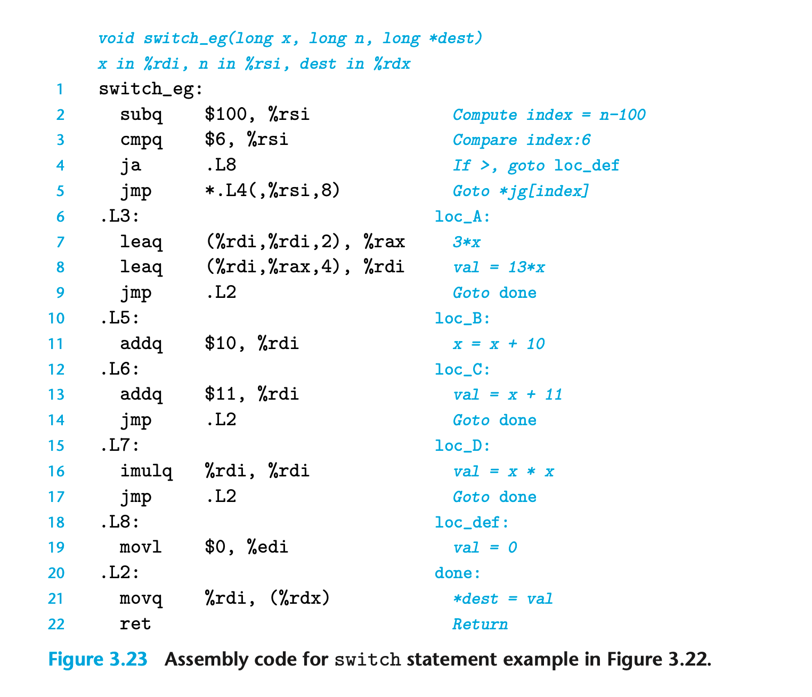
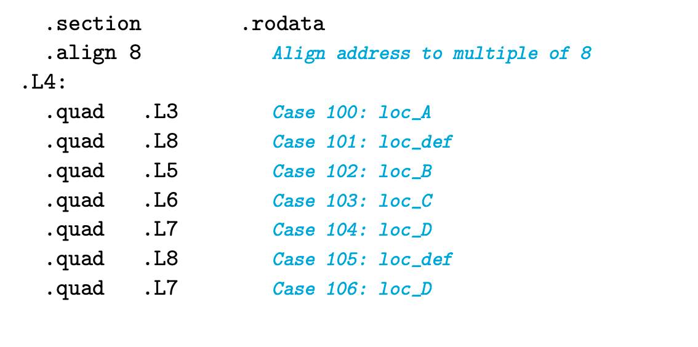

### 3.6.8 Switch Statements
switch 提供了多路选择的能力 在处理有很多种可能性的tests时很有用
底层可以基于 jump table 实现；是一种高效的实现方式
jump table 实质是一个数组； entry i 是 一块分支代码的逻辑地址
GCC在编译时，基于 case 数量和他们的稀疏程度决定是否使用 jump table

.rodata 代表 read-only data ； 汇编代码中直接将 jump table 存储在这个表中； switch的时候直接根据计算出来的index跳转即可
