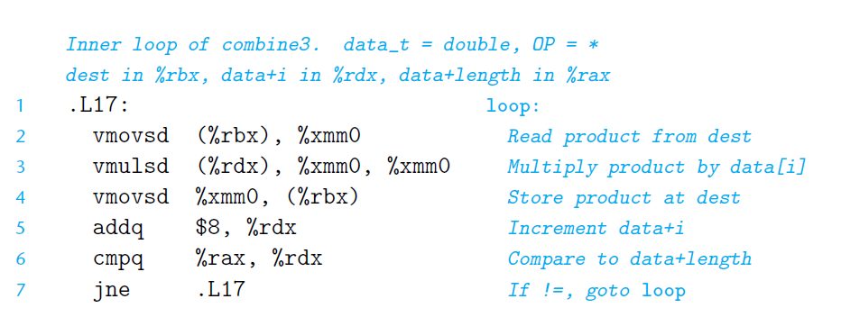

# Ch5 Optimizing Program Performance

## 5.5 Reducing Procedure Calls

在循环中减少不必要的过程调用。例如，明显不会发生数组越界的循环中，每次访问数组元素是进行边界检查，是一个较大的开销。

## 5.6 Eliminating Unneeded Memory References

减少不必要的内存引用。下面的方法中，有两次读和一次写，写内存导致了大开销。

可以通过累计的方法，减少写，最后统一写，来减少开销。

这种优化必须要程序员自己做出，编译器不会做出这种优化。因为存在内存别名（内存重叠）的情况下，往往会发生和程序原目的不一样的情况。

