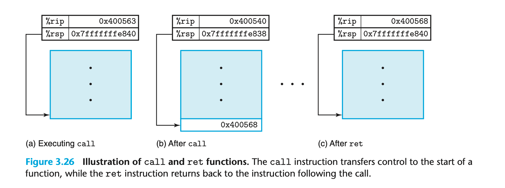
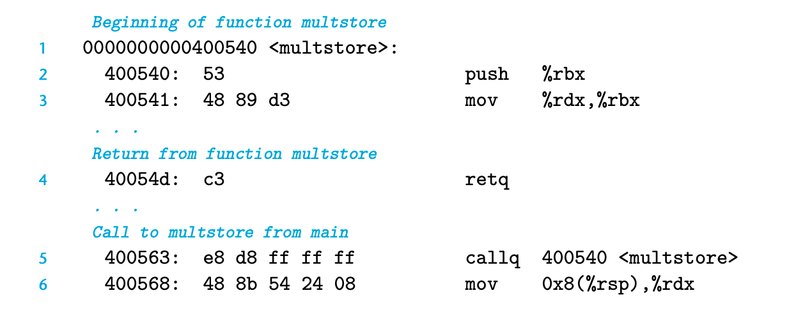

### 3.7.1 The Run-Time Stack
并不是每个函数都需要占用调用栈；如果函数所需的参数完全可以被寄存器存储也不会调用其他函数的时候。

### 3.7.2 Control Transfer
调用函数需要转移程序控制权；做法是将PC程序计数器设置到Q代码的开始地址。
当Q返回时，处理器需要知道代码应该从哪里开始恢复执行。 当P调用Q的时候，相关信息都会被保存下来。
return address 是 call 之后的下一个指令的地址；会被保存在栈中。

### 3.7.3 Data Transfer
程序需要传递参数；返回值；因此除了转移控制也需要转移数据。
参数 %rdi %rsi
返回值 %rax
