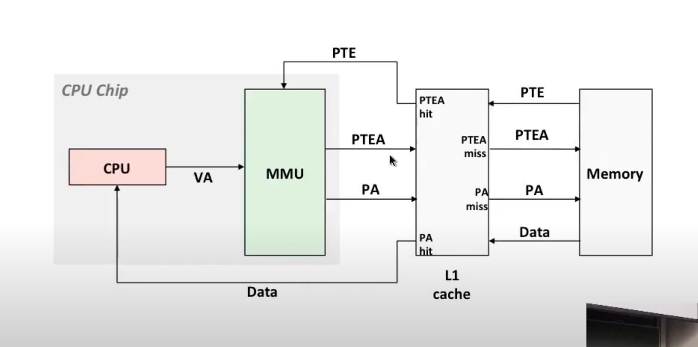
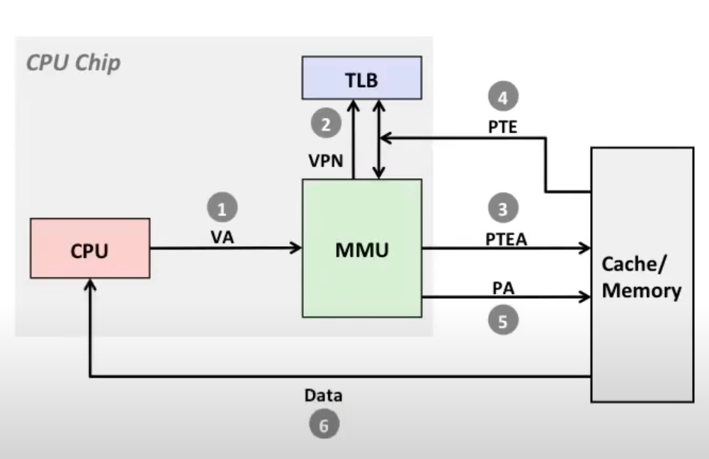

## Virtual Memory Concepts

### Why Virtual Memory?

- Uses main memory efficiently
  - Use DRAM as a cache for parts of a virtual address space
- Simplifies memory management
  - Each process gets the same uniform linear address space
- Isolates address spaces
  - One process can't interfere with another's memory
  - User program cannot access privileged kernel information and code

### Integrating VM and Cache

### TLB Miss

