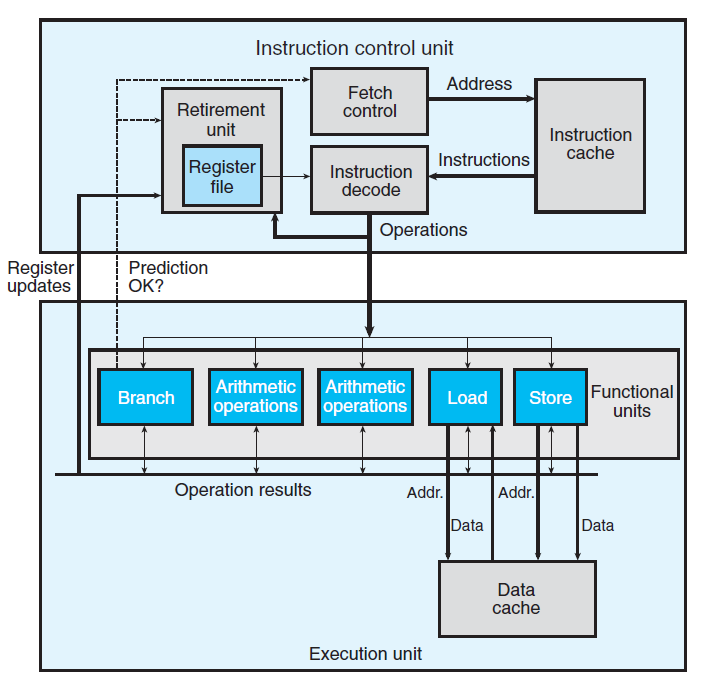

# Ch5 Optimizing Program Performance

## 5.7 Understanding Modern Processors

**5.7.1 Overall Operation**

下图为一个简化的现代微处理器的架构图。现代处理器都是超标量的，能在每个时钟周期内以乱序执行多个操作（乱序：指令的执行顺序并不和机器级代码顺序一致），设计分为指令的控制单元（Instruction Control Unit）和执行单元（Execution Unit）。

ICU 的过程：

1. ICU 从 instruction cache 中读取指令，通常会在正在指令指令很早之前进行取指操作，取指是会进行分支预测技术和投机执行技术。
2. 指令译码操作会将指令转为一组操作（可能包含多个操作），例如`addq %rax, %rdx` 和 `addq %rax, 8(%rdx)`，后者会被分为多个操作。对指令进行分解，能使得任务在一组专门的硬件单元之间分割，使得这些单元能并行执行多条指令的不同部分。

