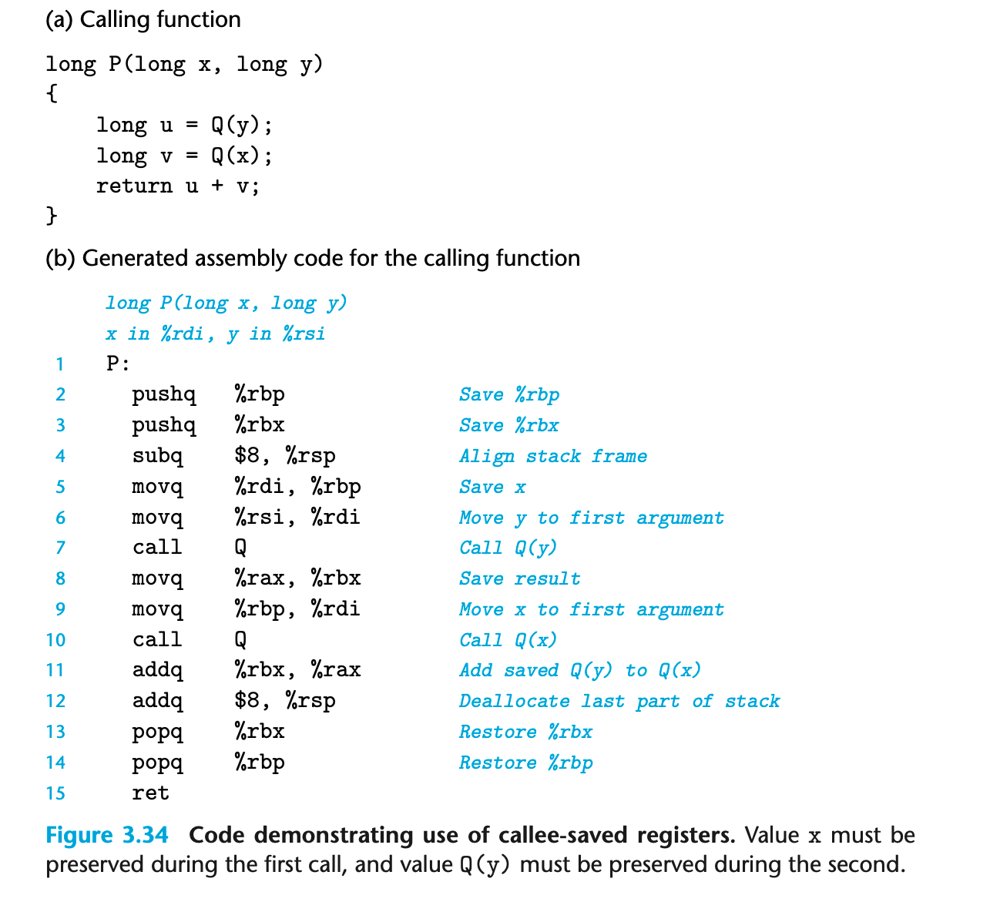

### 3.7.5 Local Storage in Registers
callee 不能因为覆写register 导致 caller 要用的 register 值获取不到了
x86-64 因此设计了一套公约

rbx rbp r12-r15 是 callee-saved 寄存器 callee saved

P call Q; Q 需要保存这些寄存器 等Q返回时P需要看到和原来一样的数据
Q 要么不改变这些寄存器；要么就得放到栈上等会返回的时候再从栈里恢复这些数据

其他寄存器都是 caller saved %rsp除外
P的本地变量可能需要由P保存

第一步需要作为callee保存现场；最后要恢复现场。
在中间会作为caller将本地变量保存在rbp rbx中；同时将参数写入rdi中。

