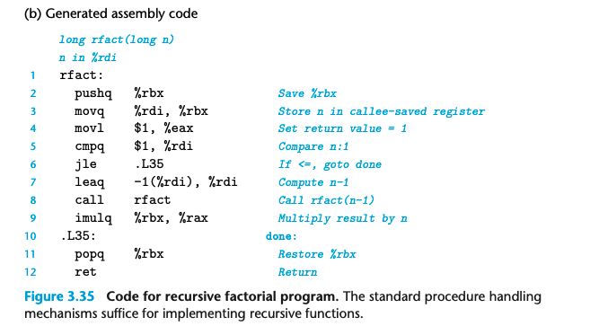

### 3.7.6 Recursive Procedures
前面描述的寄存器和栈的使用方式可以帮助我们实现递归。

```
  long rfact(long n)
  {
      long result;
      if (n <= 1)
        result = 1;
      else
        result = n * rfact(n-1); 
      return result;
  }
```



%rbx 存放 n； %rax 存放返回值
stack的机制让每次函数调用都有一块空间存储 callee-saved register 和 返回值； 需要的话，也可以存储本地变量
mutal recursion 也可以实现