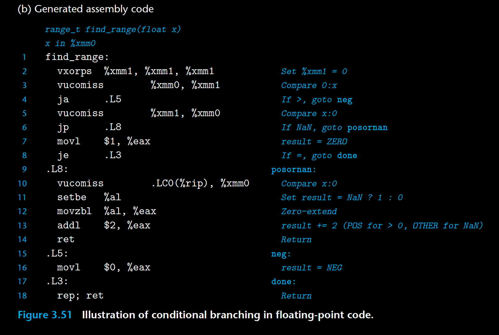

 As an example of floating-point comparisons, the C function of Figure 3.51(a) 

 classifies argument x according to its relation to 0.0, returning an enumerated type 

 as the result. Enumerated types in C are encoded as integers, and so the possible 

 function values are: 0 (NEG), 1 (ZERO), 2 (POS), and 3 (OTHER). This final outcome 

 occurs when the value of x is NaN. 

 Gcc generates the code shown in Figure 3.51(b) for find_range. The code 

 is not very efficient—it compares x to 0.0 three times, even though the required 

 information could be obtained with a single comparison. It also generates floatingpoint 

 constant 0.0 twice—once using  vxorps , and once by reading the value from 

 memory. Let us trace the flow of the function for the four possible comparison 

 results: 

* x < 0.0 The ja  branch on line 4 will be taken, jumping to the end with a return 

 value of 0. 

* x = 0.0 The ja (line 4) and jp (line 6) branches will not be taken, but the je 

 branch (line 8) will, returning with %eax equal to 1. 

* x > 0.0 None of the three branches will be taken. The setbe (line 11) will yield 

 0, and this will be incremented by the addl instruction (line 13) to give a 

 return value of 2. 

* x = NaN The jp branch (line 6) will be taken. The third vucomiss instruction 

 (line 10) will set both the carry and the zero flag, and so the setbe 

 instruction (line 11) and the following instruction will set %eax to 1. This 

 gets incremented by the addl instruction (line 13) to give a return value 

 of 3. 
 
