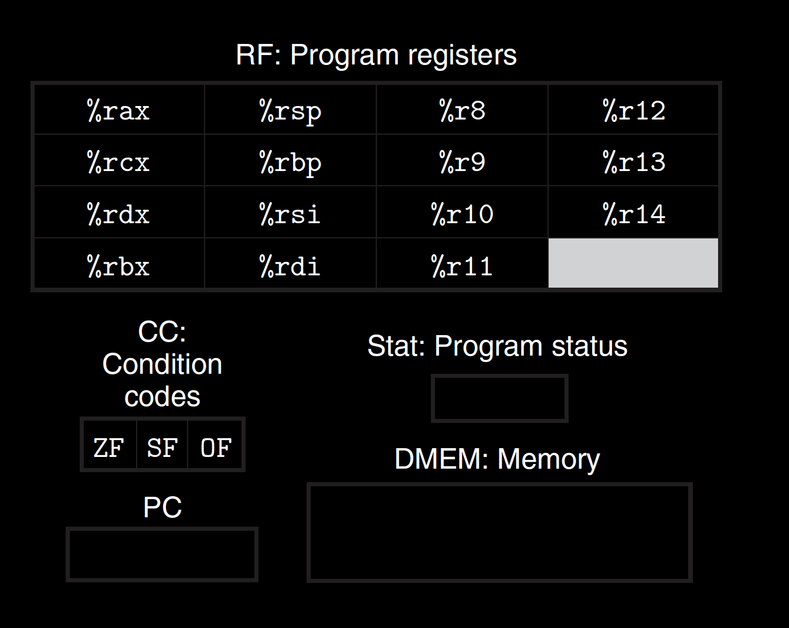

Y86-64 programmervisible state. As with x86-64, programs for Y86- 64 access and modify the program registers, the condition codes, the program counter (PC), and the memory. The status code indicates whether the program is running normally or some special event has occurred.

