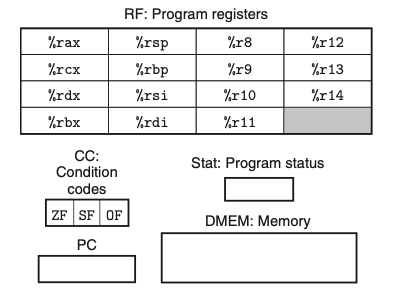

## 4.1 The Y86-64 Instruction Set Architecture
定义一个指令集包括： state | set of instructions | encodings | set of programming conventions | handling of exception events

### 4.1.1 Programmer-Visible State
需要定义一些指令去修改和读取 处理器的状态； 所谓程序员-可见，指的是写汇编或者输出机器码的编译器所见。

Y86-64中定义了15个寄存器；都是64位。 %rsp 用于栈指针；push pop call 和 return 指令会操作他。其余寄存器都可以随意使用。
ZF、SF、OF 保存最近的逻辑或者算数指令的副作用。
PC 保存当前执行的指令地址。
memory 是逻辑上的内存；可以认为是一个大的数组。通过虚拟地址访问；操作系统和硬件会将虚拟地址转化为物理地址。

Stat 表示程序执行的状态。 用于指示正常执行或者出现异常，比如指令试图读非法地址。