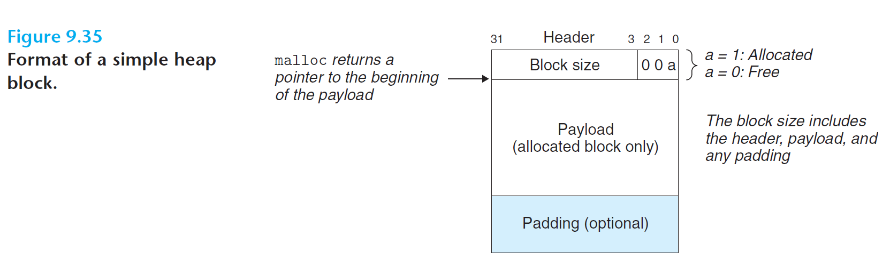
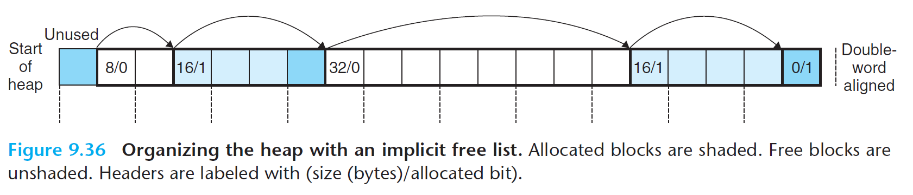

# Ch9 VM as a Tool for Caching

## 9.9 Dynamic Memory Allocation

### 9.9.6 Implicit Free Lists

分配器为了将特定信息嵌入分配块中，一般一个块由头部、有效载荷、额外填充组成，其中：

* 头部编码了这个块的大小（包含了头部和所有填充大小）。
* 有效载荷为调用 malloc 时请求的有效载荷。
* 填充是分配器的策略，可能用于解决外部碎片，也可能用于满足对齐需求。

隐式空闲链表：将空闲块通过头部中的大小字段隐含地连接。

* 优点：简单。
* 缺点：任何操作的开销，都要对空闲链表进行搜索，且搜索时间与堆中已分配块和空闲块地总数呈线性关系。

