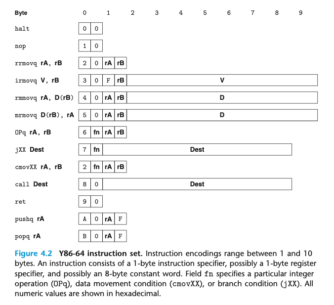

## 4.2 Y86-64 instructions
Y86-64是x86-64的子集，只包括8比特的整型操作，更少的寻址模式，更少的指令操作。

* irmovq rrmovq mrmovq rmmovq
表示 immediate register memory 的 source 和 destination
mm im 不被允许
* addq subq andq xorq
只允许在寄存器上操作；会设置 ZF SF 和 OF
* jmp jle jl je jne jge jg
* cmovle, cmovl, cmove, cmovne, cmovge, and cmovg
rrmovq 但是要求 destination 必须满足 condition
* call 在栈上推入返回地址并跳转到目标地址； ret 则用于返回
* pushq and popq 和 x86-64一致
* halt 结束指令执行

