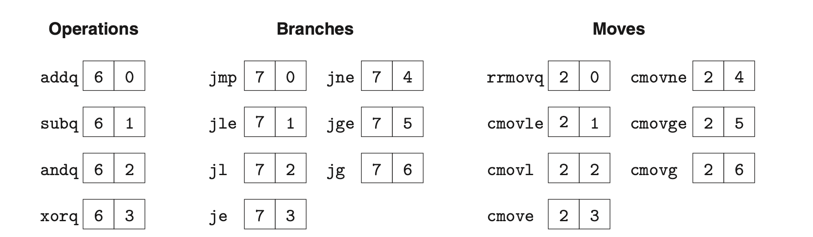

### 4.1.3 Instruction Encoding

每个指令可能由1-10个字节组成。
第一个字节包含两个部分，分别是code部分和function部分，用于标识指令。
function用于标识共享同一code的一组指令。

需要operands的指令有多余一字节的编码；register specifier byte 用于标识使用一或两个寄存器，用ra和rb标识，各占4位。一共有15个不同的寄存器，F表示没有寄存器。相关信息在CPU中存储。

有的指令存在constant word字段，一共8字节。用于表示立即数、偏移、分支终点等等。
为了简化，在Y86-64中所有地址都采用绝对地址。

%rsp,0x123456789abcd(%rdx) 编码后为 4042cdab896745230100
逆序是因为采用小端编码。