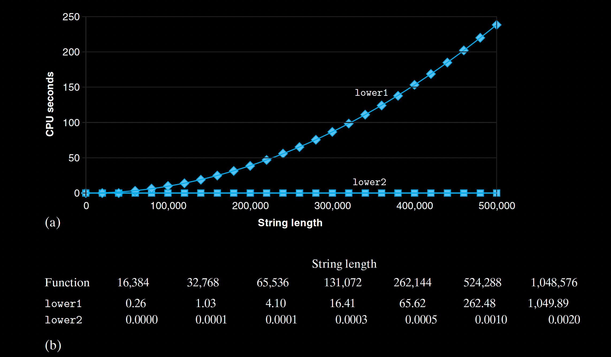

*In an ideal world, a compiler would recognize that each call to* *strlen* *in* *the loop test will return the same result, and thus the call could be moved out of* *the loop. This would require a very sophisticated analysis, since* *strlen* *checks* *the elements of the string and these values are changing as* *lower1* *proceeds. The* *compiler would need to detect that even though the characters within the string are* *changing, none are being set from nonzero to zero, or vice versa. Such an analysis* *is well beyond the ability of even the most sophisticated compilers, even if they* *employ inlining, and so programmers must do such transformations themselves.* 
