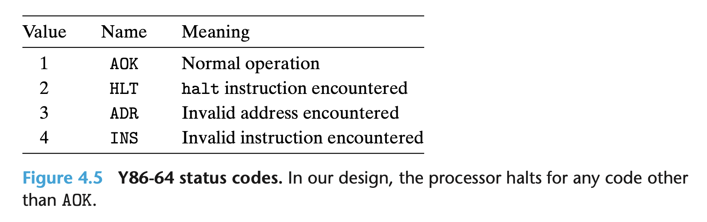

# 4.1.4 Y86-64 Exceptions
用户可见的状态中包含一个 Stat 的状态，用于标识程序运行的状态。

AOK 表示程序正常运行。 HLT 表示遇到了 halt 指令。 ADR 表示访问了非法的内存地址，在读写时都会遇到。 INS 则表示遇到了未知的指令编码。

在工业级的处理器实现中，我们通常遇到异常会触发 exception handler，由他处理不同的异常情况。可能是终止程序，也可能是触发用户定义的 signal handler。我们在第8章详细介绍。