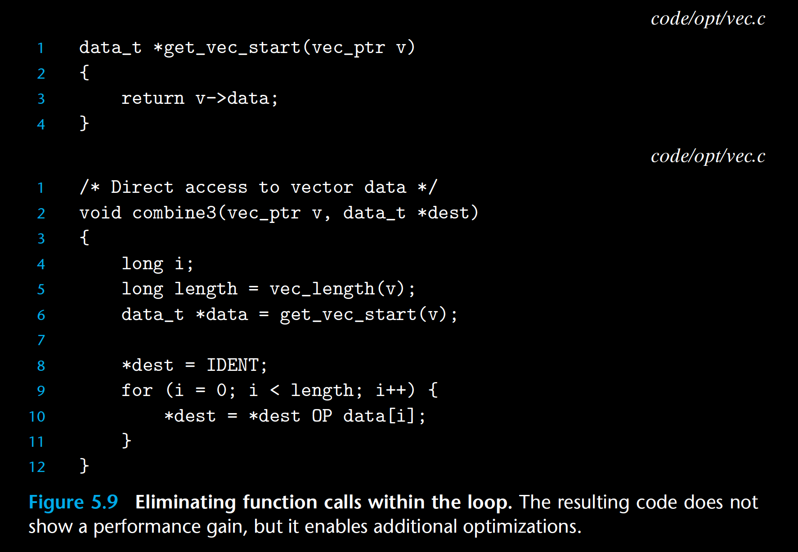
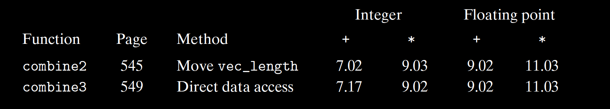

*As we have seen, procedure calls can incur overhead and also block most forms of*

*program optimization.We can see in the code for* *combine2* *(Figure 5.6) that* *get_*

*vec_element* *is called on every loop iteration to retrieve the next vector element.*

*This function checks the vector index* *i* *against the loop bounds with every vector*

*reference, a clear source of inefficiency. Bounds checking might be a useful feature*

*when dealing with arbitrary array accesses, but a simple analysis of the code for*

*combine2* *shows that all references will be valid.*

*Suppose instead that we add a function* *get_vec_start* *to our abstract data*

*type. This function returns the starting address of the data array, as shown in*

*Figure 5.9. We could then write the procedure shown as* *combine3* *in this figure,*

*having no function calls in the inner loop. Rather than making a function call to*

*retrieve each vector element, it accesses the array directly.Apurist might say that*

*this transformation seriously impairs the program modularity. In principle, the*

*user of the vector abstract data type should not even need to know that the vector*

*contents are stored as an array, rather than as some other data structure such as a*

*linked list. A more pragmatic programmer would argue that this transformation*

*is a necessary step toward achieving high-performance results.*

*Surprisingly, there is no apparent performance improvement. Indeed, the*

*performance for integer sum has gotten slightly worse. Evidently, other operations*

*in the inner loop are forming a bottleneck that limits the performance more*

*than the call to* *get_vec_element**. We will return to this function later (Section*

*5.11.2) and see why the repeated bounds checking by* *combine2* *does not incur a*

*performance penalty. For now, we can view this transformation as one of a series*

*of steps that will ultimately lead to greatly improved performance.*

