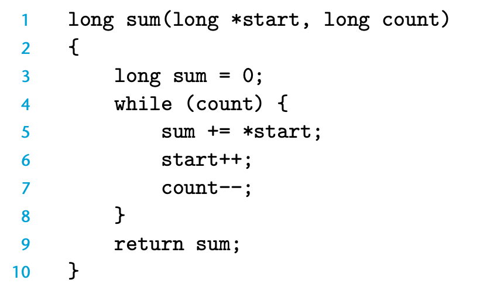
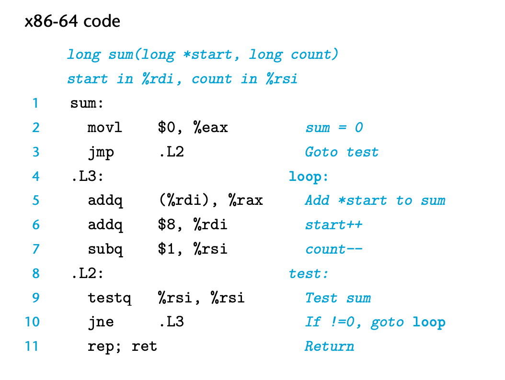
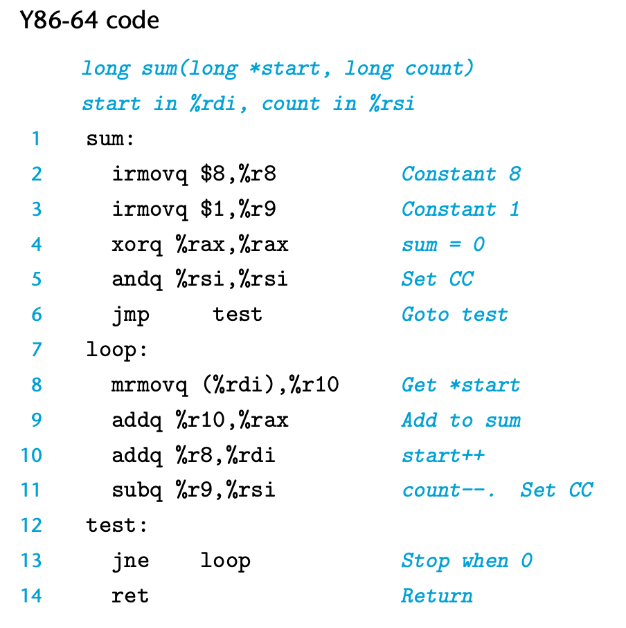
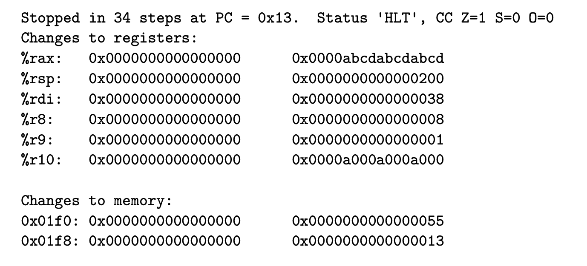

# 4.1.5 Y86-64 Programs

x86-64 汇编

Y86-64 汇编

Y86-64 对从内存读数据再累加到寄存器需要两条指令，而 x86-64 则只需要一条。

作者提供了一个指令集模拟器YIS，可以用于执行 Y86-64 汇编代码；做 lab 可以用。

register 和 memory 的变化会被模拟器打出来，左侧是原来的值，右侧则是新的值。
可以看到 %rax 变成了数组的和。
可以看到栈是从高往低增长的，和代码区域没有交集。