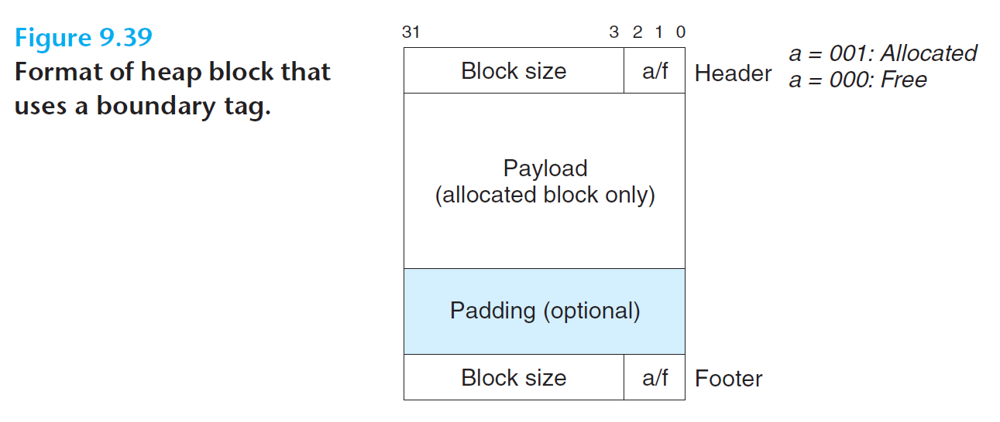

# Ch9 VM as a Tool for Caching

## 9.9 Dynamic Memory Allocation

### 9.9.11 Coalescing with Boundary Tags

为了达到常数时间内进行对前面块的合并，在每个块的结尾处添加一个脚部（footer，边界标记），其中脚部是头部的一个副本；分配至直接检查脚部（当前块的前一个字的位置）来判断前面一个块的起始位置和状态。

缺陷：要求每个块保持头部和脚部，操作多个小块时，会产生显著的内存开销。

