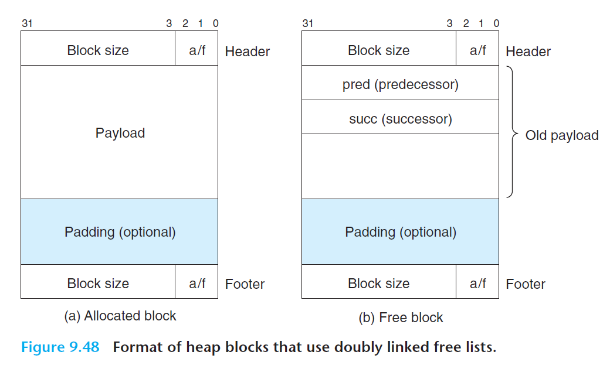

# Ch9 VM as a Tool for Caching

## 9.9 Dynamic Memory Allocation

### 9.9.13 Explicit Free Lists

隐式空闲链表缺点：块分配和堆块的总数呈线性关系。

显示空闲链表：将空闲块组织为某种显示的数据结构，可以使 First fit 的分配时间从块总数的线性时间减少到空闲块数量的线性时间。

* 以 LIFO 的顺序维护链表，将新释放的块放置在链表的开始处。分配块会最先检查最近使用过的块，释放块可以在常数时间内完成。
* 以地址顺序来维护链表，其中链表中的每个块的地址都小于其后继地址。释放时需要线性时间来搜索定位合适的前驱；但 First Fit 下比 LIFO 排序具有更高的内存利用率，接近最佳适配的利用率。

显示链表的缺点：空闲块必须足够大，因为需要包含需要的指针以及头部脚部，这样容易提升内部碎片的成都。

