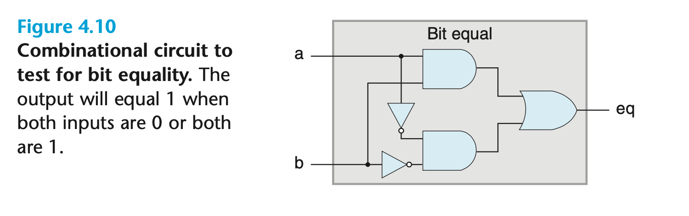
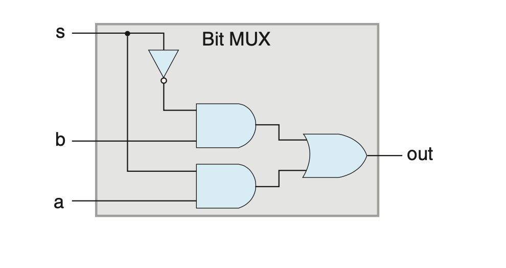

## 4.2 Logic Design and the Hardware Control Language HCL

数字系统包括三个主要部分：memory elements、combination logic、clock signal。
分别用于存储状态、计算状态和对状态更新进行控制。
本章节介绍这三个部分和 HCL（硬件控制语言）。

### 4.2.1 Logic Gates
与或非而已啦；与代码逻辑有别，类似的语法可以用于描述电路。

### 4.2.2 Combinational Circuits and HCL Boolean Expressions
`bool eq = (a && b) || (!a && !b);`

逻辑门组合起来就是组合电路。需要有输入和输出，输出可以是记忆单元，也可以是其他逻辑门的输入。
多个输出不能相连。
不能有环。

下图是一个多路选择器。 s 用于控制输出的是 a 还是 b。
`bool out = (s && a) || (!s && b);`

HCL 和 C 看起来很像，但是有些显著的区别：
1. HCL的输出随着输入变化而变化，可能有微小的延迟。但是 C 语言只有运行的时候进行 evaluate。
2. C 语言的变量可以是任意值。 HCL 只有 bit。
3. C 语言存在部分求值； HCL 不存在。

本质在于 HCL 是在描述电路，而不是计算过程。